# Individual Log: Monday 25th Sept 2023 - Sunday 1st Oct 2023

## Tasks Worked On During the week

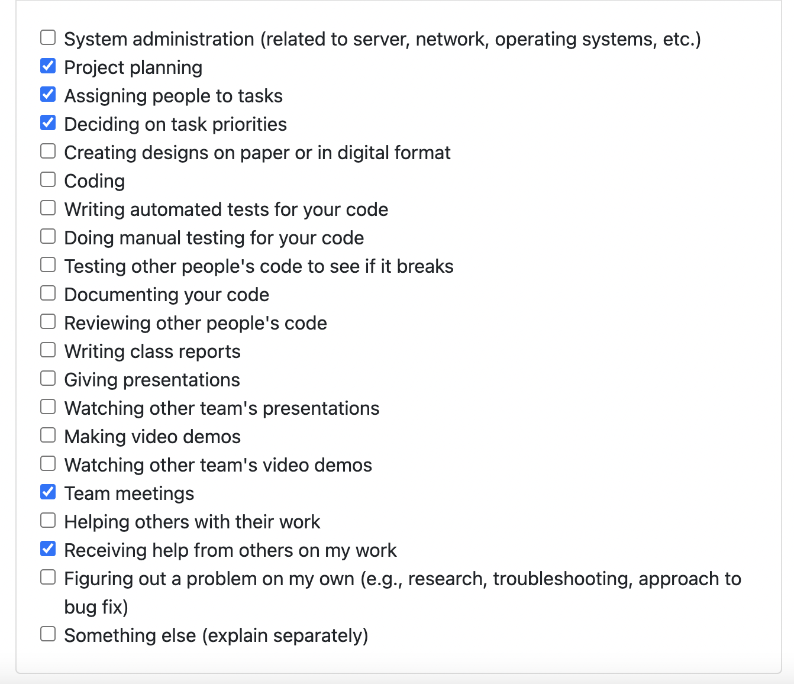

## Recap of goals
- Team meeting organisation
- Project planning 
- Setting up the team repository 
- Completed documents for logs 
## Tasks completed
- Organising team meeting for discussing team strenghts and weakness 
- Helped the team to complete the project planning 
- Helped the team to set the milestone goals 
- Decided on the tech to use for the project
- Helped the team to prioritise the task and allocate it to team members
- Completed the team log 
Completed individual log 
## Tasks in progress
All the above tasks were successfully completed. 
## Additional Information

N/A.

---
---

## Week 5: Monday 2nd Oct 2023 - Sunday 8th Oct 2023

### Tasks Worked On During the week
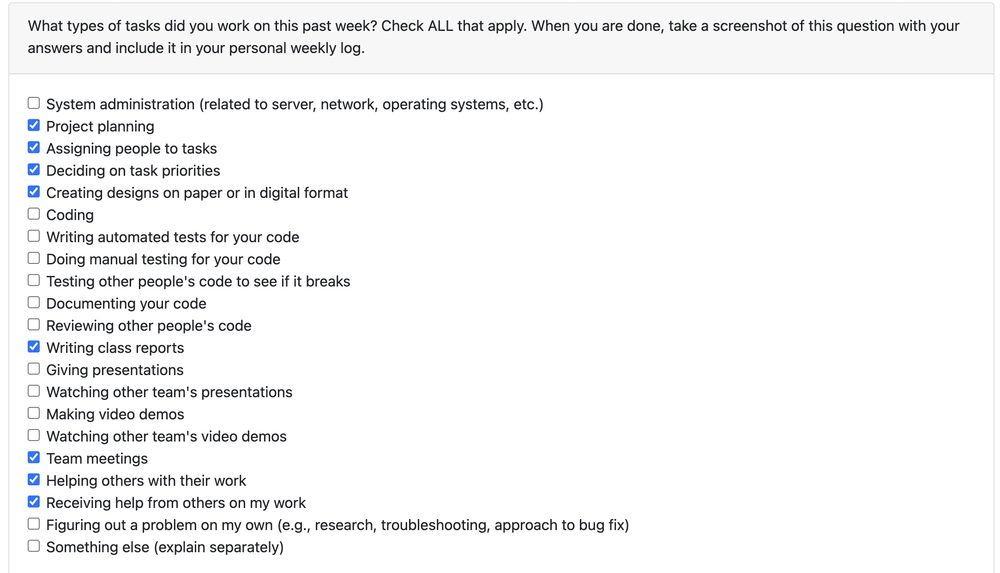

### Recap of goals

- Discussed the potential names for the app 
- Collaborate with team to plan the overview structure of the app.
- Helped assign and prioritize tasks to be completed.
- Helped build a prototype (low fidelity)
- Completed the weekly logs.
- Completed individual logs

### Tasks completed (from Project Board)
- Decide app structure
- Decide app UI
- Design the login and signup page on Figma
- Assisted in assigning and prioritizing the tasks.
- Complete team log.

### Tasks in progress (from Project Board)

All the above mentioned tasks are completed

### Additional Information

N/A.
---
---
## Weeks 6 and 7: Monday 9th Oct 2023 - Sunday 22nd Oct 2023

### Tasks Worked On During the week
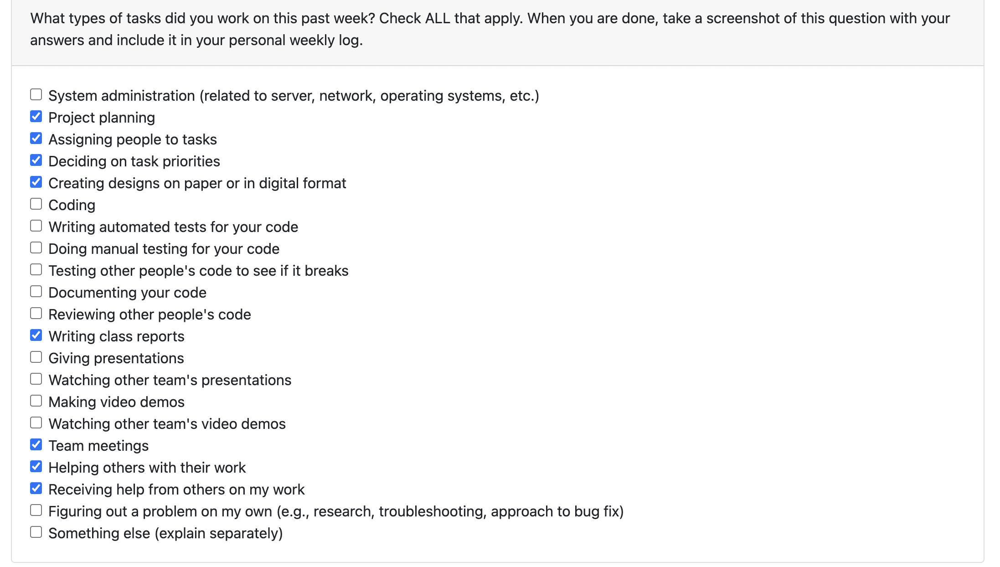
### Recap of goals
- Discussed the app names with my team 
- Prioritise the tasks 
- Helped the team to further design the app structure 
- Designed the profile page on figma 
- Discussed the entities and relationship among themm for the database
- Created the ER diagram
- Completed weekly log

### Tasks completed (from Project Board)
- Design the "add post" page on Figma
- Design the order completed page on Figma
- Create an ER diagram for database structure
- Complete team log for Weeks 6 and 7#8

### Tasks in progress (from Project Board)

No task currently in progress as all have been completed.

### Additional Information

N/A.

---
---
## Week 8: Monday 23rd Oct 2023 - Sunday 29th Oct 2023

### Tasks Worked On During the Week
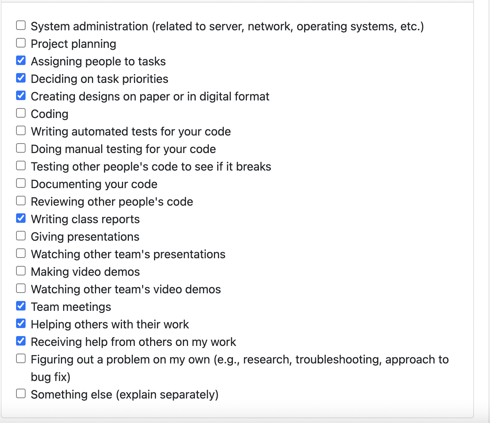
### Recap of goals

- Helped the team to Decide on the app name.
- Helped assign and prioritize tasks to be completed.
- Discuss the presentation goals
- Rehearsed the live-demo for the presentation.
- Made the ER diagram better and fixed issues reccomended by the TA
- Began learning and installed Flutter SDK onto my device.
- Wrote down team logs 

### Tasks completed (from Project Board)

- Modify ER diagram based on feedback from TA
- Add project specifics to the presentation
- Learn Flutter
- Install Flutter SDK onto devices.
- Finish presentation and practice it.
- Complete team log for Week 8.
- Reviewed other team members' PRs and assigned team members to PRs.

### Tasks in progress (from Project Board)

No task currently in progress as all have been completed.

### Additional Information

N/A.

---
---
## Week 9: Monday 30th Oct 2023 - Sunday 5th Nov 2023

### Tasks Worked On During the Week

### Recap of goals
- Helped the team to make presentation 
- Worked on the project specific part of the presentation 
- Also added ER diagram to the presentation
- Prepared for presenting 
- Could not give the presentation (due to illness)
- Watched and assessed other team's presentation
- Discussed and prioritise task 
- Worked on the test for initiating the libraries of firebase 
- Worked on the test for signup mock 

### Tasks completed (from Project Board)
- Test to verify if firebase libraries are getting initialized
- Complete team log for W9
- Complete individual log for W9

### Tasks in progress (from Project Board)
- Test for the signup mock.

---

### Week 10: Monday 6th Nov 2023 - Sunday 12th Nov 2023

### Tasks Worked On During the Week
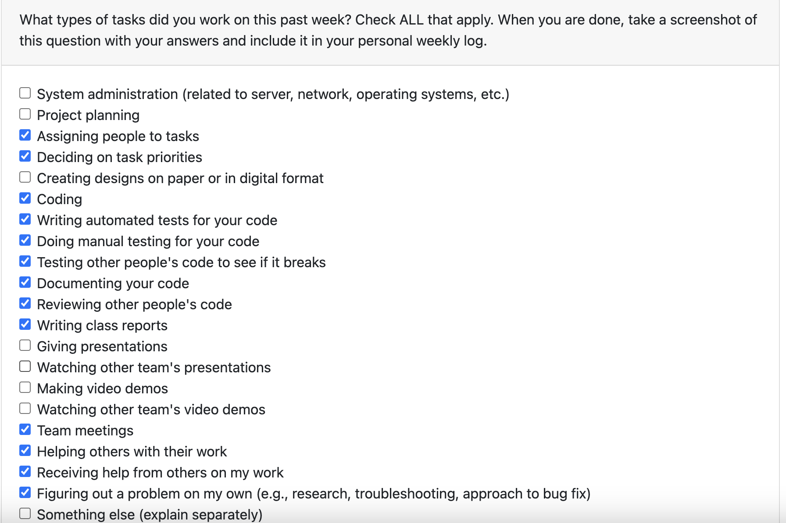

#### Recap of personal goals
- Assisted in planning out our features for the upcoming milestone.
- prioritized the tasks to be done
- started working on the UI for main page (home page)
- writing the test for UI home page
- Completed the weekly logs
- Completed individual log

### Tasks completed (from Project Board)

- Main view food item page UI
- Widget test for the item page UI
- Complete week 10 weekly log
- Complete week 10 individual log
- Assisted in planning out the features left for the milestone and the tasks associated with them.
- Reviewed other team members' PRs and assigned team members to PRs.

### Tasks in progress (from Project Board)
- No task currently in progress as all have been completed.

### Additional Information
- N/A.

---
---

### Individual Log: Monday 13th Nov 2023 - Sunday 26th Nov 2023

## Tasks Worked On During the week
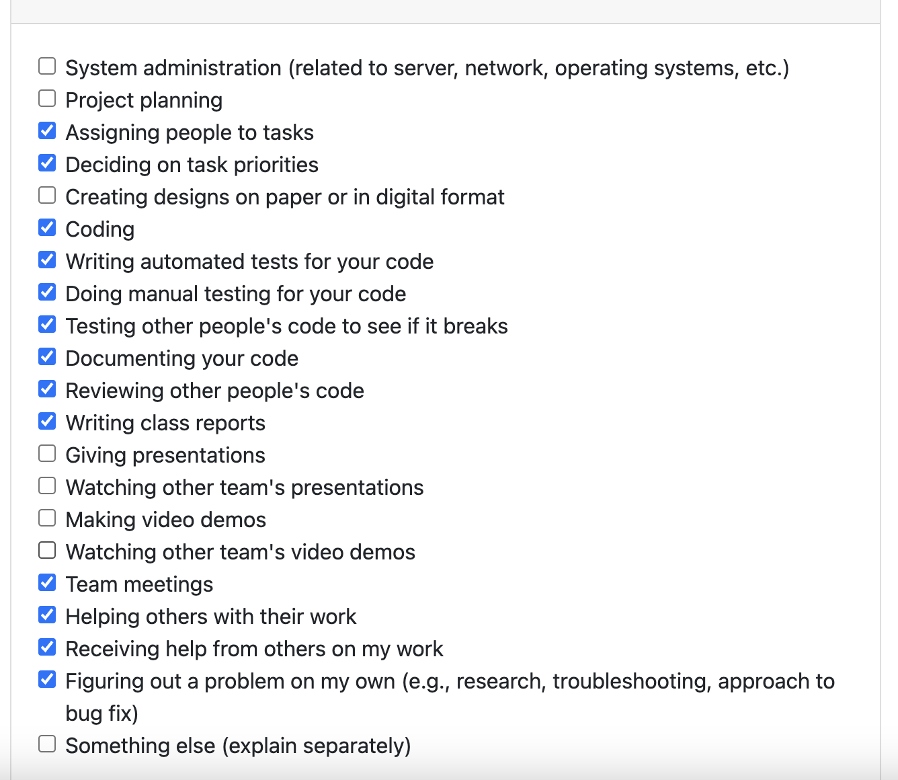

## Recap of personal goals
- Planned the features to be completed for this milestone
- Continued working on the Home page
- Created another Post card file so that all the posts can be in one place
- Added placeholders to add the image to the home page
- Added the tag buttons to filter the post
- Made the test for the UI better . Added multiple things to it. Test passed
- Reviewed multiple branches
- Helped with the team log
- Completed the individual log

## Tasks completed (from Project Board)
- Modify the home screen UI to fix bugs
- Design tests for the home screen (viewing all posts)
- Complete the week 11 and 12 team log
- Complete the week 11 and 12 individual logs

## Tasks in progress (from Project Board)
- Complete the home screen (viewing all posts) by adding functionality

Additional Information 

N/A.

---
---

## Week 13: Monday 27th Oct 2023 - Sunday 3rd Dec 2023

## Tasks Worked On During the week
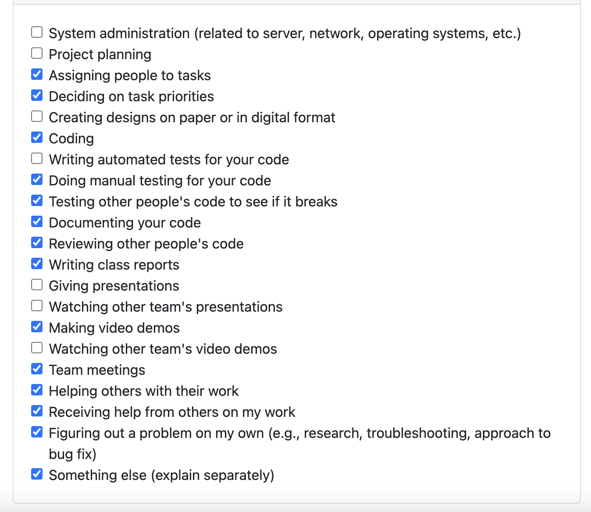
## Recap of personal goals
- Planned the features to be completed for this milestone
- Started working on the backend functionality of the home page 
- Created a method to read data from the firebase (title, name, tags etc)
- Arrannging all the post in descending order by time
- Making all the posts cards clickable
- Work on the implementation of the search bar 
- Search bar allows user to enter text and filter the post based on the text entered
- Created test for reading the data from a mock firebase
- Created test for search bar 
- Work on the design documentation to be submitted
- Complete team log 
- Complete individual log

## Tasks completed (from Project Board)
- Home page backend funct
- Home screen data reading backend functionality
- Create a search bar for the home screen for users to search through posts (backend)
- Create a test for verifying successful document read
- Recap of features for design doc
- Database design for design doc
- Complete Week 13 individual log
- Complete Week 13 team log

## Tasks in progress (from Project Board)
- All the task from the project board is completed

Additional Information 

N/A.

---
---

## Term 2 Week 1: Monday 8th Jan 2023 - Sunday 14th Dec 2023

### Tasks Worked On During the Week
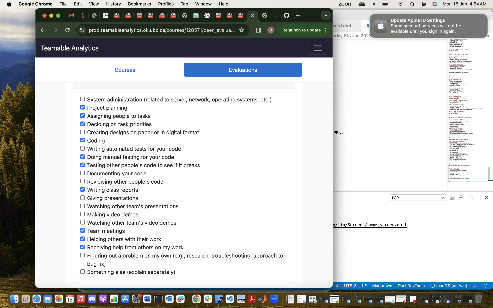
### Recap of personal goals
- Planning the team meeting to start the project again 
- Helped prioritise the task
- Worked through my previous code to get a catchup 
- Fixed a few bugs related to the search bar
- Completed logs for the week

### Tasks completed (from Project Board)
- Fixed bug for the search bar
- Complete Week 13 team log.
- Complete Week 13 individual log.
- Reviewed other team members' PRs and assigned team members to PRs.

### Tasks in progress (from Project Board)

- No tasks currently in progress as all have been completed.

### Additional Information

N/A.

---
---

## Term 2 Week 3: Monday 22nd Jan 2024 - Sunday 28th jan 2024

### Tasks Worked On During the Week
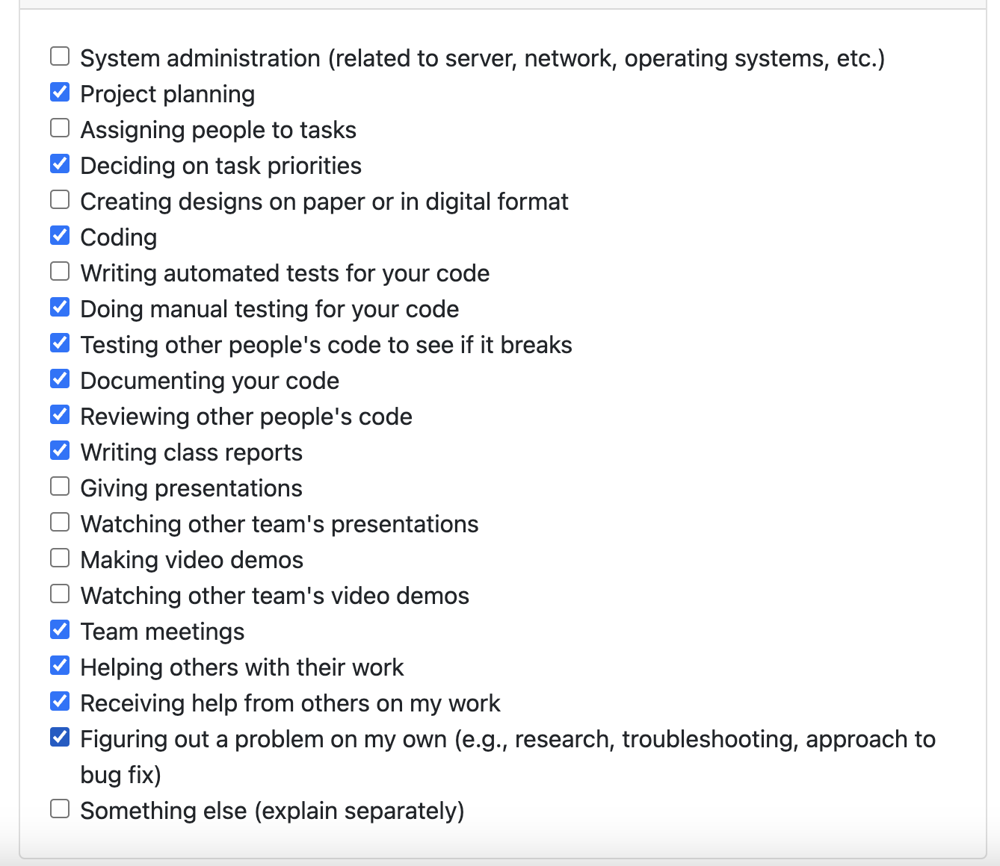
### Recap of personal goals
- Met with the team to discuss the goals of this week 
- Made the task priority list 
- Create the front end for donor rating page
- Created the front end for donee rating page
- Created the back end for donor rating page
- Created back end for donee rating page
- Storing the comments , rating and average rating into the firebase from both the donor and donee pages 
- Created front end and back end tests for both donor and donee rating pages
- Completed logs for this week 

### Tasks completed (from Project Board)
- Complete the donor rating system (front-end + back-end)
- Complete the donee rating system (front-end + back-end)
- Complete test for donor and donee rating system
- Complete Term 2 Week 3 Team Log
- Complete Term 2 Week 3 Individual logs

### Tasks in progress (from Project Board)

- No tasks currently in progress as all have been completed.

### Additional Information

N/A.

---
---

## Term 2 Week 4: Monday 29th Jan 2024 - Sunday 04th Feb 2024

### Tasks Worked On During the Week
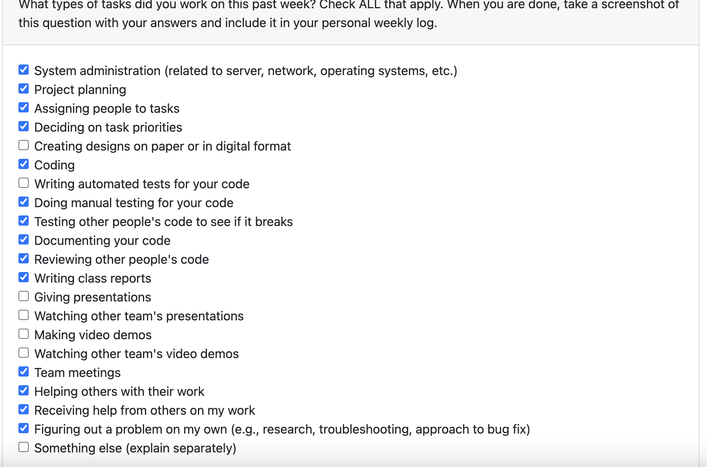

### Recap of personal goals
- Helped plan out the features for coming milestone
- Helped assign and prioritize tasks to be completed.
- Team meetings to priotise tasks to be done and assigning task to team mates
- Fix bugs like navigation of the review screen to the home screen
- Discuss and made the tasks to be given to the users for peer testing
- Preparing the intro and questionnaire questions for the peer testing
- Worked on the feedback given during the peer testing 
- Made the post dissapear from home screen if it is reserved
- Fixed the keyboard and the cancel button on the home screen
- Display message if there is no post available to show on the home screen 

### Tasks completed (from Project Board)
- Review navigation 
- Fix the navigation bug from the rating page
- Complete the list of tasks for the peer testing
- Remove a post from the home screen if it is reserved
- Fix bug that doesn't make the keyboard disappear if the search bar is clicked on iOS
- Add a text message when there is no post available to the home screen
- Complete T2 W4 Individual Logs

### Tasks in progress (from Project Board)

- No tasks currently in progress as all have been completed.

### Additional Information

N/A.

-----
-----

## Term 2 Week 5: Monday 05th Feb 2024 - Sunday 11th Feb 2024

### Tasks Worked On During the Week

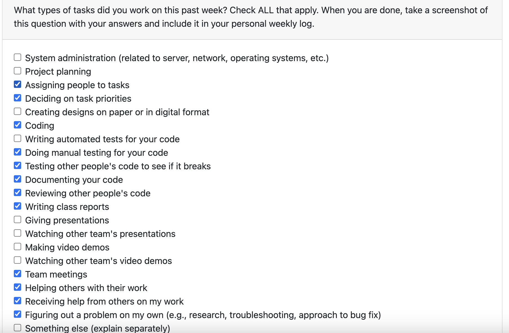
### Recap of personal goals
- Helped plan out the feature to work on this week
- Team meating to prioritise and assign tasks for people 
- Completed the message UI
- Completed the tests for message UI
- Contributed to team log
- Completed individual log

### Tasks completed (from Project Board)
- Complete the messaging page front-end
   - Added the app bar title which leads to public profile 
   - Added recieved text 
   - Added sent text 
   - Added a text box to enter messages
   - Added recommended messages 
- Complete the T2 W5 individual logs
- Reviewed other team members' PR.

### Tasks in progress (from Project Board)

- No tasks currently in progress as all have been completed.

### Additional Information

N/A.

-----
-----

## Term 2 Week 6: Monday 12th Feb 2024 - Sunday 18th Feb 2024

### Tasks Worked On During the Week
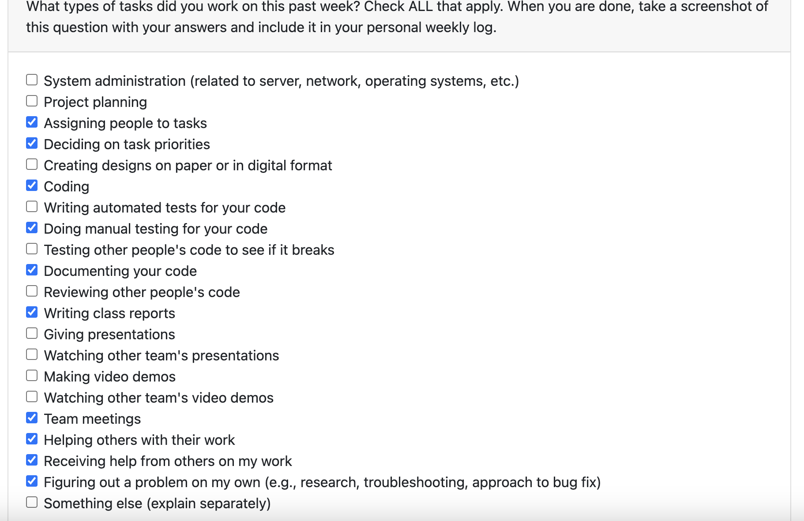
### Recap of personal goals
- Helped plan out the feature to work on this week
- Team meating to prioritise and assign tasks for people 
- Removed reserve post from browse screen
- Removed reserve post from saved screen 
- Contributed to team log
- Completed individual log

### Tasks completed (from Project Board)
- Remove the posts from browse and saved screen if they have been reserved
- Complete the T2 W6 individual logs

### Tasks in progress (from Project Board)

- No tasks currently in progress as all have been completed.

### Additional Information

- I was not well this week and I have already given my doctor's note to the Professor

-----
-----

## Term 2 Week 7 and 8: Monday 19 Feb 2024 - Sunday 3rd March 2024

### Tasks Worked On During the Week
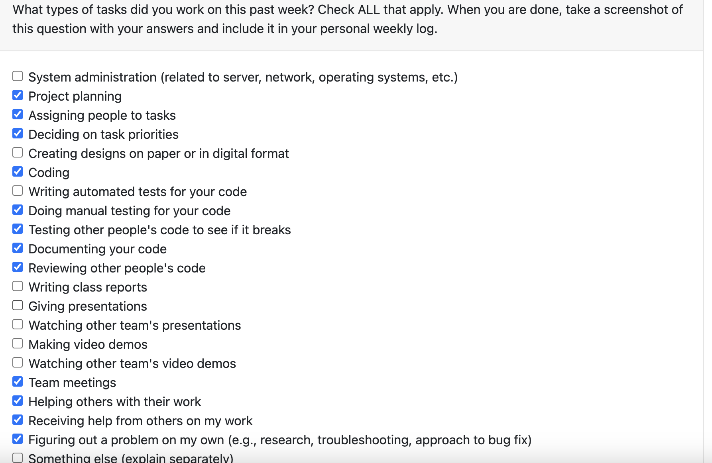
### Recap of personal goals
- Helped plan out the feature to work on this week
- Team meating to prioritise and assign tasks for people 
- Worked on the backend implementation of the public profile
- Completed blocking feature 
- Contributed to team log
- Completed individual log

### Tasks completed (from Project Board)
- Complete the public profile backend
   - Extraction of various components from firebase
   - Blocking feature
   - Display ratings and comments from firebase
   - Edit profileAppBar based on infromation from firebase
   - Changed circle avatar 

- Complete the T2 W6 individual logs

### Tasks in progress (from Project Board)

- No tasks currently in progress as all have been completed.

### Additional Information

-----
-----

## Term 2 Week 9: Monday 4th march 2024 - Sunday 10th March 2024

### Tasks Worked On During the Week

### Recap of personal goals
- Meeting with team to decide what task to give during peer testing
- Peer testing in class
- Taking feedback and issues related to the app
- resolve all the fix in public profile
- Making necessary changes like navigation , circle avatar and blocking in the public profile
- Contributed to team log
- Completed individual log

### Tasks completed (from Project Board)
- Fix public profile bugs
   - Fixed navigation to the correct post detail from recent post section
   - Fixed the alignment of review and recent post when none is available
   - Set the avatar to default for review
   - After blocking is done it goes back to public profile screen

- Complete the T2 W9 individual logs

### Tasks in progress (from Project Board)

- No tasks currently in progress as all have been completed.

### Additional Information
- My flutter stopped working this week for some reason , so It took me around 3 days to fix that issue

-----
-----

## Term 2 Week 10: Monday 11th Mar 2024 - Sunday 17th Mar 2024

### Tasks Worked On During the Week
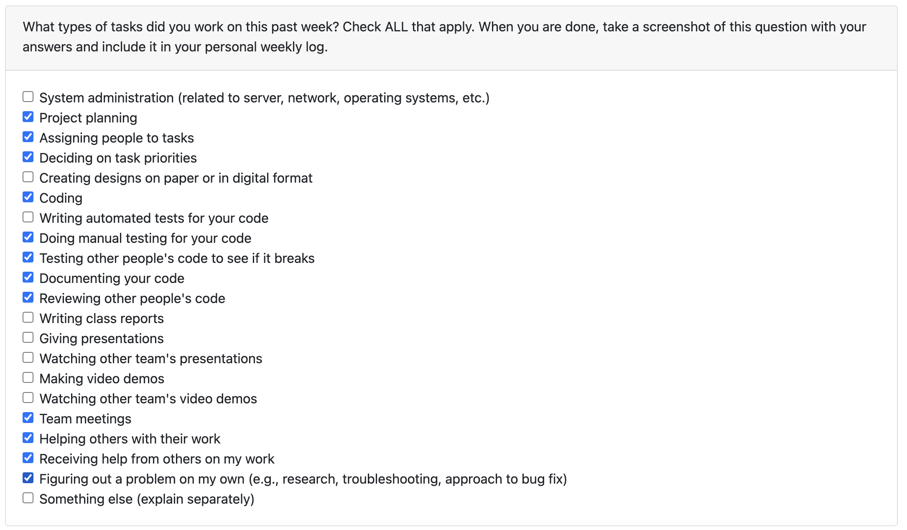

### Recap of personal goals
- Helped in planning out the features for the upcoming milestone 
- Helped assign and prioritize tasks to be completed.
- Fixing bugs on public profile page 
- Functionality for the filter button on the home screen
- Functionality for the filter cupertino buttons on the home screen 
- Completed the weekly logs.

### Tasks completed (from Project Board)
- Add filtering to the home page
  - Added the UI for filtering 
  - Filter post based on categories 
  - Filter post based on allergens 
  - Filter post based on day 
- Complete the T2 W10 individual log.
- Reviewed other team members' PRs and assigned team members to PRs.

### Tasks in progress (from Project Board)
- Add filtering to the home page
  - Filter post based on time 

  ## Term 2 Week 11: Monday 25th Mar 2024 - Sunday 31th Mar 2024

### Tasks Worked On During the Week
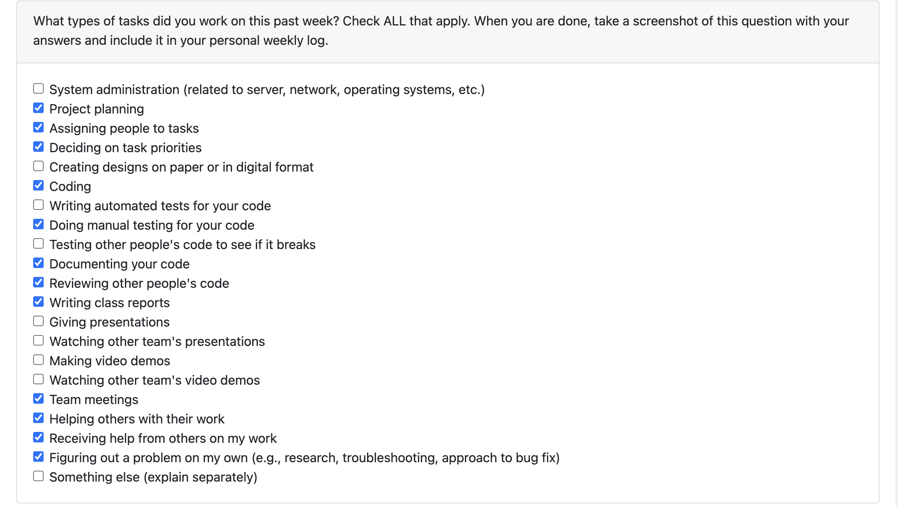

### Recap of personal goals
- Helped in planning out the features for the upcoming milestone 
- Helped assign and prioritize tasks to be completed.
- Added an All tab to the filter menu
- Worked on All tab functionality 
- Fetched categories from firebase
- Worked on improving filter
- Completed the weekly logs.

### Tasks completed (from Project Board)
- Complete the filtering bug fixes
  - Added the All for filtering  
  - Cupertino buttons gets from firebase 
  - Added functionality for them 
- Complete the T2 W10 individual log.
- Reviewed other team members' PRs and assigned team members to PRs.

### Tasks in progress (from Project Board)
- Add filtering to the home page
  - categories are not working 
- Blocking is not working