# Individual Log: Ishita Gupta

## Week 4: Monday 25th Sept 2023 - Sunday 1st Oct 2023

### Tasks Worked On During the week

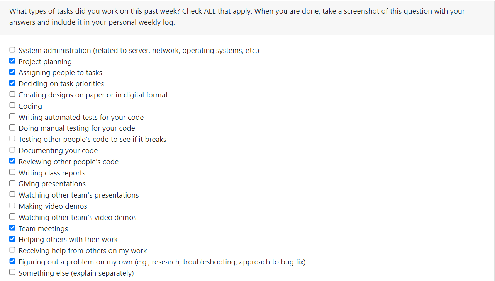

### Recap of goals

- Planning the project and its scope.
- Help assign and prioritize tasks to be completed.
- Setup project repository.
- Complete the project plan document.
- Complete the weekly logs.

### Tasks completed

- Participated in project planning with the team.
- Helped complete the project plan documentation - Overview, Individual Strengths and Weaknesses, Envisioned Usage, Major Milestones, Technology Stack, and Teamwork Distribution.
- Assisted in assigning and prioritizing the tasks.
- Reviewed other team members' PRs and assigned team members to PRs.
- Contributed to the team log.

### Tasks in progress

No task currently in progress as all have been completed.

### Additional Information

N/A.

---
---

## Week 5: Monday 2nd Oct 2023 - Sunday 8th Oct 2023

### Tasks Worked On During the week

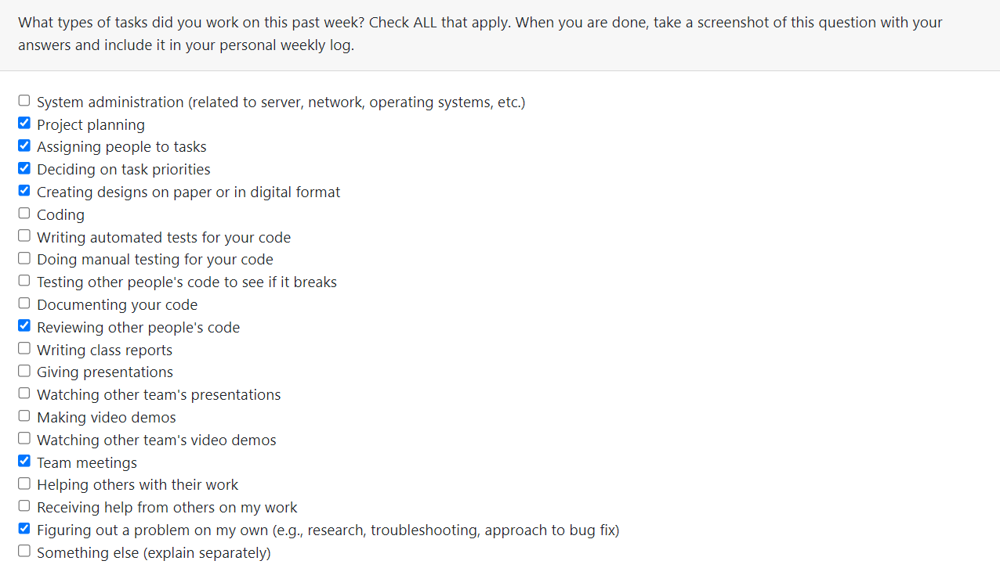

### Recap of goals

- Collaborated with team to discuss potential app names.
- Helped plan the app structure.
- Helped assign and prioritize tasks to be completed.
- Helped with the low-fidelity sketch of the app's overall UI design.
- Updated the project board.
- Completed the weekly logs.

### Tasks completed (from Project Board)

- Decide app structure
- Decide app UI
- Design the login and signup page on Figma
- Assisted in assigning and prioritizing the tasks.
- Reviewed other team members' PRs and assigned team members to PRs.
- Complete team log.

### Tasks in progress (from Project Board)

No task currently in progress as all have been completed.

### Additional Information

N/A.

---
---

## Weeks 6 and 7: Monday 9th Oct 2023 - Sunday 22nd Oct 2023

### Tasks Worked On During the week

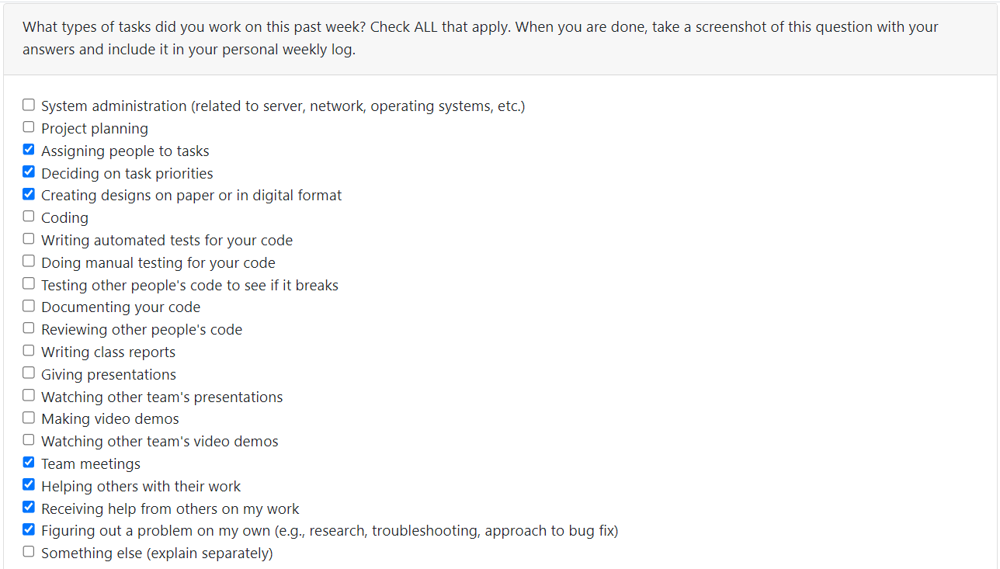

### Recap of goals

- Collaborated with team to discuss the app name.
- Helped plan the app structure further.
- Helped assign and prioritize tasks to be completed.
- Designed several pages of the app on Figma.
- Managed and Updated the project board.
- Completed the weekly logs.

### Tasks completed (from Project Board)

- Design the "add post" page on Figma
- Design the settings page on Figma and create detailed flows
- Design the chat page on Figma
- Design the public profile page on Figma
- Complete team log for Weeks 6 and 7
- Reviewed other team members' PRs and assigned team members to PRs.

### Tasks in progress (from Project Board)

No task currently in progress as all have been completed.

### Additional Information

N/A.

---
---

## Week 8: Monday 23rd Oct 2023 - Sunday 29th Oct 2023

### Tasks Worked On During the Week

### Recap of goals

- Decided on the app name.
- Helped assign and prioritize tasks to be completed.
- Collaborated with team to discuss the presentation goals.
- Rehearsed the live-demo for the presentation.
- Designed the donor workflow on Figma.
- Added interactions to several pages on Figma to create a prototype.
- Began learning and installed Flutter SDK onto my device.
- Managed and updated the project board.
- Completed the weekly logs.

### Tasks completed (from Project Board)

- Create a donor workflow on Figma.
- Add interactions to the designs on Figma.
- Learn Flutter
- Install Flutter SDK onto devices.
- Finish presentation and practice it.
- Complete team log for Week 8.
- Reviewed other team members' PRs and assigned team members to PRs.

### Tasks in progress (from Project Board)

No task currently in progress as all have been completed.

### Additional Information

N/A.

---
---

## Week 9: Monday 30th Oct 2023 - Sunday 5th Nov 2023

### Tasks Worked On During the Week

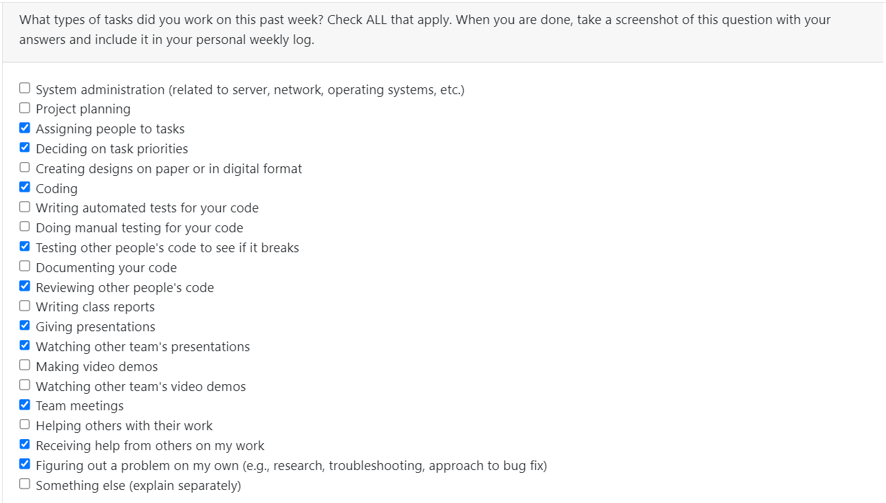

### Recap of goals

- Helped assign and prioritize tasks to be completed.
- Completed and rehearsed presentation with team.
- Watched other team's presentations.
- Worked on the login and signup feature.
- Managed and updated the project board.
- Completed the weekly logs.

### Tasks completed (from Project Board)

- Complete the signup and login feature.
- Complete team log for Week 9.
- Reviewed other team members' PRs and assigned team members to PRs.

### Tasks in progress (from Project Board)

No task currently in progress as all have been completed.

### Additional Information

N/A.

---
---

## Week 10: Monday 6th Nov 2023 - Sunday 12th Nov 2023

### Tasks Worked On During the Week

### Recap of personal goals

- Assisted in planning out our features for the upcoming milestone.
- Helped assign and prioritize tasks to be completed.
- Started working on the "create post" feature from the project plan.
- Completed the widget test for it.
- Worked on the design code of the "create post" screen.
- Completed the weekly logs.
- Updated and managed the Project Board.

### Tasks completed (from Project Board)

- Create a post UI and widget test.
  - Completed a widget test for the UI of the screen.
  - Design code of the "create post screen"
    - Added various input text fields for various details about the food.
    - Added "save" and "close" buttons.
    - Manually tested the code and fixed bugs.
- Complete Week 10 team log
- Complete Week 10 individual log
- Assisted in planning out the features left for the milestone and the tasks associated with them.
- Reviewed other team members' PRs and assigned team members to PRs.

### Tasks in progress (from Project Board)

No task currently in progress as all have been completed.

### Additional Information

N/A.

---
---

## Weeks 11 and 12: Monday 13th Nov 2023 - Sunday 26th Nov 2023

### Tasks Worked On During the Week

### Recap of personal goals

- Assisted in planning out our features for the upcoming milestone.
- Helped assign and prioritize tasks to be completed.
- Continued working on the "create post" feature from the project plan.
- Created the settings page with UI and widget tests and functionality.
- Completed the weekly logs.
- Updated and managed the Project Board.

### Tasks completed (from Project Board)

- Create a post feature.
  - Modified the widget test for the UI of the screen.
  - Design code of the "create post screen"
    - Modified the design to look similar to Figma.
    - Manually tested the code and fixed bugs.
  - Functionality
    - Added functionality to the create post by enabling it to write to firestore.
- Settings page
  - Created a widget test for the settings page UI.
  - Completed the design code for the settings page.
  - Added functionality to it.
- Complete Weeks 11 and 12 team log
- Complete Week 12 individual log
- Reviewed other team members' PRs and assigned team members to PRs.

### Tasks in progress (from Project Board)

- Design more tests for the create post feature.

### Additional Information

N/A.

---
---

## Week 13: Monday 27th Nov 2023 - Sunday 3rd Dec 2023

### Tasks Worked On During the Week

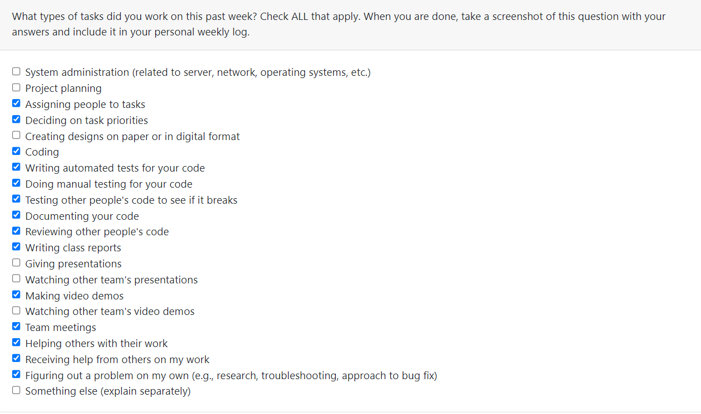

### Recap of personal goals

- Assisted in planning out our features for the upcoming milestone.
- Helped assign and prioritize tasks to be completed.
- Continued working on the backend for the "create post" feature.
- Created a custom cupertino chip widget for UI.
- Created a custom reusable search bar component that searches through a pre-defined list of items and displays the selected items as chips.
- Created a mock firestore service to mock firestore addDcoument and readDocument functions to test adding and reading data.
- Modified the create post widget test to include more test cases.
- Added a mock test to verify document additon.
- Modified the settings page and settings UI test by fixing bugs.
- Completed the weekly logs.
- Updated and managed the Project Board.

### Tasks completed (from Project Board)

- Fix bugs in settings page
- Fix the UI widget test of settings
- Create a post backend feature.
  - Modified the widget test for the UI of the screen to add more test cases.
  - Added data to firestore using a function created by a team member.
- Create a custom search bar which includes backend implementation for the pre-defined lists of allergens, categories, and pickup locations.
  - Created a custom cupertino chip widget to display the selected items from the search bar
- Create a mock firestore service for testing document reading and writing.
- Create a mock test for verifying successful document addition.
- Recap of features of design doc.
- System architecture for design doc.
- Complete Week 13 team log.
- Complete Week 13 individual log.
- Reviewed other team members' PRs and assigned team members to PRs.

### Tasks in progress (from Project Board)

- Design more tests for the create post feature.

### Additional Information

N/A.

---
---

## Term 2 Week 1: Monday 8th Jan 2024 - Sunday 14th Jan 2024

### Tasks Worked On During the Week

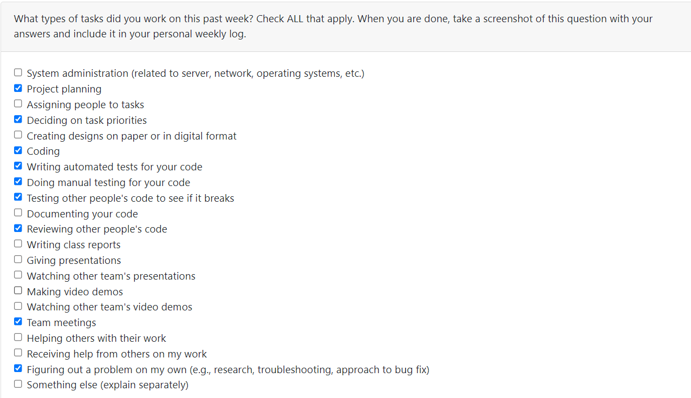

### Recap of personal goals

- Assisted in planning out our features for the upcoming milestone.
- Helped assign and prioritize tasks to be completed.
- Worked on the front-end of the forgot password page.
- Completed the UI test for the forgot password page.
- Researched integration tests for Firebase and Flutter.
- Completed the weekly logs.
- Updated and managed the Project Board.

### Tasks completed (from Project Board)

- Front-end of forgot password page.
- Test for forgot password page.
- Plan features for the upcoming milestone.
- Complete Week 13 team log.
- Complete Week 13 individual log.
- Reviewed other team members' PRs and assigned team members to PRs.

### Tasks in progress (from Project Board)

- No tasks currently in progress as all have been completed.

### Additional Information

N/A.

---
---

## Term 2 Week 2: Monday 15th Jan 2024 - Sunday 21st Jan 2024

### Tasks Worked On During the Week

### Recap of personal goals

- Assisted in planning out our features for the upcoming milestone.
- Helped assign and prioritize tasks to be completed.
- Updated the settings page with new links for the buttons.
- Added delete account functionality.
- Added widget tests for the settings screen.
- Added the accessibility screen.
- Added a slider for users to choose their preferred font size.
- Added a text_scale_provider.dart that notifies other screens of font size changes.
- Added widget tests for the accessibility screen.
- Completed the weekly logs.
- Updated and managed the Project Board.

### Tasks completed (from Project Board)

- Update the settings page to add account settings + test
  - Added new buttons for account settings to the settings screen.
  - Added delete account functionality.
  - Fixed bug with navigation issues on clicking the "reset password" button.
  - Added link to the accessibility settings screen on this page.
  - Completely changed the previous widget test for this new settings page.
- Add the accessibility screen to allow users to control font size + test
  - Added a slider to allow users to set their preferred font size.
  - Implemented a TextScaleProvider class that listens to the change in font size (as set by the user) and notifies other screens of the changes in real time via main.dart.
  - Developed a widget test for the accessibility screen.
- Complete the T2 W2 team log.
- Complete the T2 W2 individual log.
- Reviewed other team members' PRs and assigned team members to PRs.

### Tasks in progress (from Project Board)

- No tasks currently in progress as all have been completed.

### Additional Information

N/A.

---
---

## Term 2 Week 3: Monday 22nd Jan 2024 - Sunday 28th Jan 2024

### Tasks Worked On During the Week

### Recap of personal goals

- Assisted in planning out our features for the upcoming milestone.
- Helped assign and prioritize tasks to be completed.
- Updated the order card with a new status button for donors only.
- Added a new and updated reserve button class in posting_details.dart to save the donee id.
- Added the front-end of the first donor status screen.
- Implemented functionality to update the state of the donor screen everytime there is an update on the order.
- Ensured dark mode readability.
- Completed the weekly logs.
- Updated and managed the Project Board.

### Tasks completed (from Project Board)

- Update the order card with the new status button for donors + backend
  - Ensured that the status button on the order card is for donors only.
  - Added a new and updated reserve button class in posting_details.dart to save the donee id.
  - Fixed many bugs related to the reserve button working as intended from the donor's point of view.
- Complete all the screens/updates of the donor pathway
  - Added the front-end of the first donor status screen.
  - Implemented functionality to update the state of the donor screen everytime there is an update on the order.
  - Developed a widget test for the donor state screen.
- Complete the T2 W3 team log.
- Complete the T2 W3 individual log.
- Reviewed other team members' PRs and assigned team members to PRs.

### Tasks in progress (from Project Board)

- No tasks currently in progress as all have been completed.

### Additional Information

N/A.

---
---

## Term 2 Week 4: Monday 29th Jan 2024 - Sunday 04th Feb 2024

### Tasks Worked On During the Week

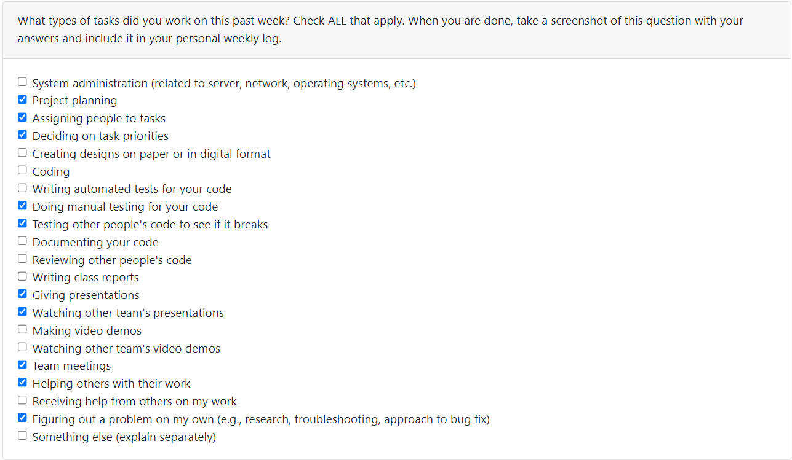

### Recap of personal goals

- Assisted in planning out our features for the upcoming milestone.
- Helped assign and prioritize tasks to be completed.
- Discussed tasks to be completed by participants with team.
- Practiced testing our app to find and fix bugs before the official session with team.
- Designed a questionnaire to be completed by participants for quantitative feedback.
- Added font size increase functionality to accounts screen and order card (as specified through users in accessibility screen)
- Fixed the overflow bug in settings when users increase the font size.
- Fixed a minor bug related to input validation in create post screen.
- Changed minor texts for UI purposes.
- Updated the pre-defined lists for allergens and categories.
- Fixed navigation bug from rating screen and reserve logic.
- Participated in and ran evaluation sessions in class.
- Fixed the bug on the edit profile screen of not being able to save changes without entering a bio.
- Updated the order status screen to accurately show text and buttons if the order has not been reserved yet.
- Completed the weekly logs.
- Updated and managed the Project Board.

### Tasks completed (from Project Board)

- Complete accessibility screen bug fixes
  - Fixed the overflow bug in settings when users increase the font size.
  - Added font size increase functionality to accounts screen and order card (as specified through users in accessibility screen)
- Complete various small bug fixes elsewhere throughout the app
  - Fixed a minor bug related to input validation in create post screen.
  - Changed minor texts for UI purposes.
  - Updated the pre-defined lists for allergens and categories.
- Fix the navigation bug from the rating page
- Complete the list of tasks for the peer testing.
- Complete the questionnaire for the peer testing.
- Order status should not show up if the order has not been reserved
  - It will not show buttons to message anyone or confirm the order if it hasn't been reserved.
  - It's heading is updated to show the order hasn't been reserved yet to correctly inform the user on the order status.
- Fix bug that requires the bio to save any other change on the edit profile screen
- Complete the T2 W4 team log.
- Complete the T2 W4 individual log.
- Reviewed other team members' PRs and assigned team members to PRs.

### Tasks in progress (from Project Board)

- No tasks currently in progress as all have been completed.

### Additional Information

N/A.

---
---

## Term 2 Week 5: Monday 05th Feb 2024 - Sunday 11th Feb 2024

### Tasks Worked On During the Week

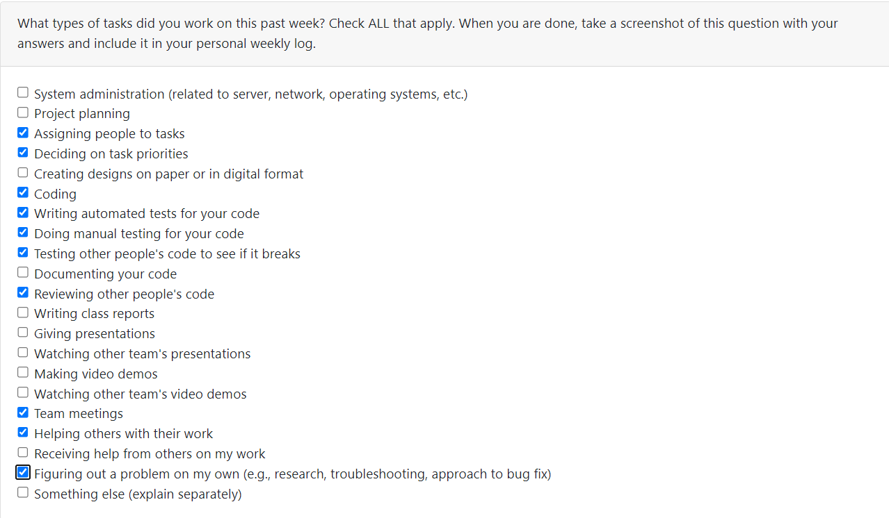

### Recap of personal goals

- Assisted in planning out our features for the upcoming milestone.
- Helped assign and prioritize tasks to be completed.
- Added the font size change functionality to various screens.
- Fix various tests to ensure they pass with the changes made.
- Generated the test report and worked to improve quality of our tests to improve the test report results.
- Completed the weekly logs.
- Updated and managed the Project Board.

### Tasks completed (from Project Board)

- Add the font size change functionality to other screens
  - Added it to the new order card and fixed bugs related to overflow when font size is increased.
  - Added it to the donor screen.
  - Added it to the edit profile screen.
  - Added it to the create post screen.
  - Added it to the saved posts/ bookmarks screen.
- Modify the tests of various files to ensure they pass.
  - Modified the tests of the accounts and settings screen because the "Edit profile" button was moved.
  - Modified the test of the create post screen.
  - Modified the test of the saved post screen.
  - Modified the test of the edit profile screen.
  - Modified the test of the donor screen.
  - Modified the mock firestore service.
- Complete the T2 W5 team log.
- Complete the T2 W5 individual log.
- Reviewed other team members' PRs and assigned team members to PRs.

### Tasks in progress (from Project Board)

- No tasks currently in progress as all have been completed.

### Additional Information

N/A.

---
---

## Term 2 Week 6: Monday 12th Feb 2024 - Sunday 18th Feb 2024

### Tasks Worked On During the Week

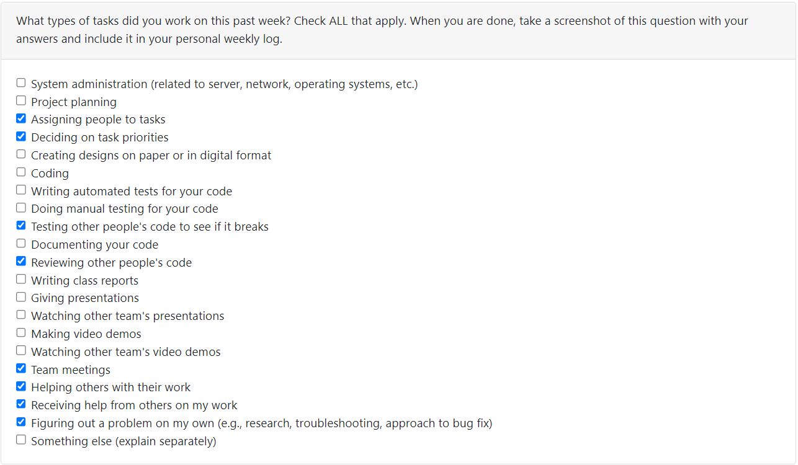

### Recap of personal goals

- Assisted in planning out our features for the upcoming milestone.
- Helped assign and prioritize tasks to be completed.
- Added the backend functionality to the donor screen - saving post status and updating the state on the page.
- Added the cancel reservation button and logic.
- Added the map to display the pin location of the post on the donor screen.
- Made UI changes to make it more cohesive.
- Completed the weekly logs.
- Updated and managed the Project Board.

### Tasks completed (from Project Board)

- Complete the donor screen backend by saving the status of the orders.
  - Added the map to display the pin location of the post on the donor screen.
  - Added the cancel reservation button and logic.
  - Added backend - saving post status and updating the state on the page.
  - Updated the UI of some components to make it more similar to the Figma design.
- Complete the T2 W6 team log.
- Complete the T2 W6 individual log.
- Reviewed other team members' PRs and assigned team members to PRs.

### Tasks in progress (from Project Board)

- No tasks currently in progress as all have been completed.

### Additional Information

N/A.

---
---

## Term 2 Week 8: Monday 26th Feb 2024 - Sunday 03rd Mar 2024

### Tasks Worked On During the Week

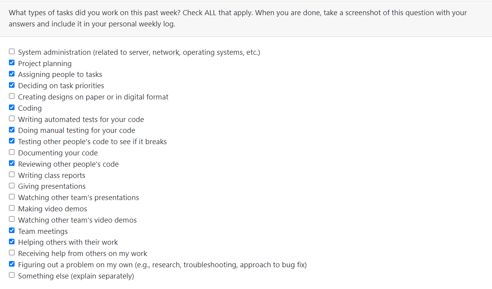

### Recap of personal goals

- Assisted in planning out our features for the upcoming milestone.
- Helped assign and prioritize tasks to be completed.
- Assisted in discussing the tasks for Peer Testing #2.
- Modified the backend functionality to the donor screen - modifying the way data is stored to firestore.
- Added profile photo reading to the donor screen.
- Added a progress bar on the donor screen.
- Displayed the user's reserved posts.
- Completed the weekly logs.
- Updated and managed the Project Board.

### Tasks completed (from Project Board)

- Display the reserved posts
- Modify the donor screen frontend + backend.
  - Added the progress bar to display the post status on the donor screen.
  - Modified the data storage for post reservation.
  - Modifed the cancel button logic.
  - Added to the category list

- Complete the T2 W8 team log.
- Complete the T2 W8 individual log.
- Reviewed other team members' PRs and assigned team members to PRs.

### Tasks in progress (from Project Board)

- No tasks currently in progress as all have been completed.

### Additional Information

N/A.

---
---

## Term 2 Week 9: Monday 04th Mar 2024 - Sunday 10th Mar 2024

### Tasks Worked On During the Week

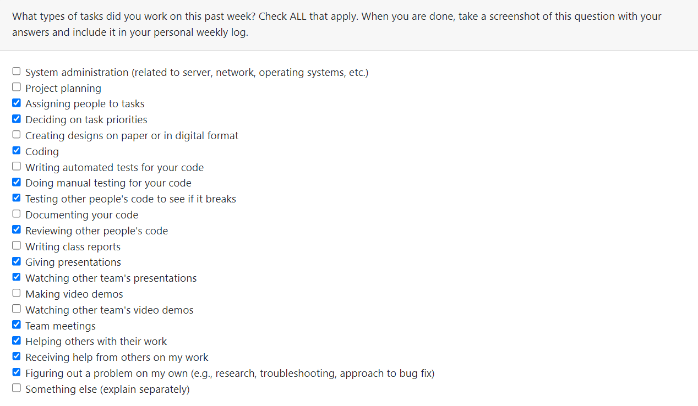

### Recap of personal goals

- Assisted in planning out our features for the upcoming milestone.
- Helped assign and prioritize tasks to be completed.
- Assisted in discussing the tasks for Peer Testing #2.
- Discussed the feedback received from Peer Testing #2 and prioritized tasks to address them this week.
- Fixed the order status bug.
- Modified the way the data is stored for a user in Firestore.
- Modified the progress bar with better front-end on the donor screen.
- Assisted in fixing the async issue on the account screen.
- Completed the weekly logs.
- Updated and managed the Project Board.

### Tasks completed (from Project Board)

- Work on the post status functionality from donor's POV with Jayati and fix donor screen bugs
  - Modified the progress bar to display the post status on the donor screen.
  - Modified the data storage for post reservation.
  - Modified the storage of information in the documents of the user collection to fix the order status bug.
  - Made a minor change to the category list.
  - Fixed the data reading on the donor screen to fix the order status bug.

- Complete the T2 W9 team log.
- Complete the T2 W9 individual log.
- Reviewed other team members' PRs and assigned team members to PRs.

### Tasks in progress (from Project Board)

- No tasks currently in progress as all have been completed.

### Additional Information

N/A.

---
---

## Term 2 Week 10: Monday 11th Mar 2024 - Sunday 17th Mar 2024

### Tasks Worked On During the Week

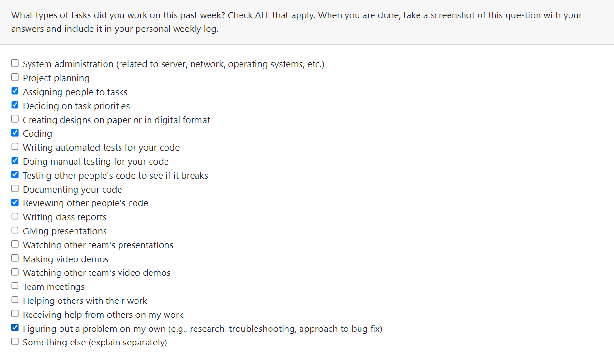

### Recap of personal goals

- Assisted in planning out our features for the upcoming milestone.
- Helped assign and prioritize tasks to be completed.
- Added functionality for active and past/completed orders.
- Reorganized how donated and reserved posts are displayed and added functionality.
- Fixed major bugs on the account screen.
- Added the progress bar as a component for reusability.
- Added location display on the donor screen using reverse geocaching.
- Completed the weekly logs.
- Updated and managed the Project Board.

### Tasks completed (from Project Board)

- Display the reserved posts
  - Reorganized how donated and reserved posts are displayed and added functionality.
  - Reorganized how active and past orders are displayed and added functionality.
  - Fixed bugs on the account screen.
  - Added location display on the donor screen using reverse geocoding.
  - Added the progress bar as a component for reusability.

- Complete the T2 W10 team log.
- Complete the T2 W10 individual log.
- Reviewed other team members' PRs and assigned team members to PRs.

### Tasks in progress (from Project Board)

- No tasks currently in progress as all have been completed.

### Additional Information

N/A.

---
---

## Term 2 Week 11: Monday 18th Mar 2024 - Sunday 24th Mar 2024

### Tasks Worked On During the Week

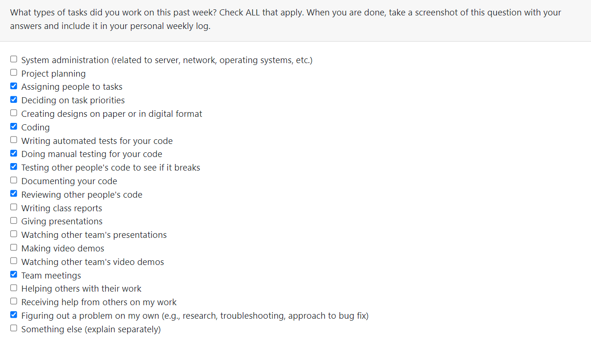

### Recap of personal goals

- Assisted in planning out our features for the upcoming milestone.
- Helped assign and prioritize tasks to be completed.
- Fixed the map initialization bug on the donor screen.
- Added new order states - not reserved and completed and changed the logic and UI to accommodate for that.
- Added image picking, uploading, and reading functionality for a delivery picture at the "Ready to Pick Up" state.
- Added a stream listener to automatically update changes on the donor screen without needing to leave the screen and come back.
- Refactored quite a bit of code and modularized it where possible.
- Completed the weekly logs.
- Updated and managed the Project Board.

### Tasks completed (from Project Board)

- Complete the donor screen completed state and photo picker functionality
  - Added new order states - not reserved and completed - and changed the logic and UI to accommodate for that.
  - Fixed the map initialization bug on the donor screen.
  - Added image picking, uploading, and reading functionality for a delivery picture at the "Ready to Pick Up" state.
  - Added a stream listener to automatically update changes on the donor screen without needing to leave the screen and come back.
  - Fixed other various bugs on the donor screen and refactored the code.

- Complete the T2 W11 team log.
- Complete the T2 W11 individual log.
- Reviewed other team members' PRs and assigned team members to PRs.

### Tasks in progress (from Project Board)

- No tasks are currently in progress as all have been completed.

### Additional Information

N/A.

---
---

## Term 2 Week 12: Monday 25th Mar 2024 - Sunday 31st Mar 2024

### Tasks Worked On During the Week

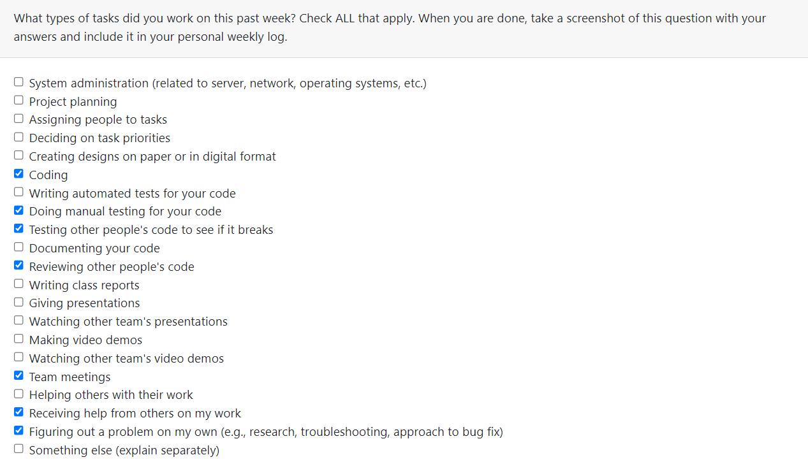

### Recap of personal goals

- Assisted in planning out our features for the upcoming milestone.
- Helped assign and prioritize tasks to be completed.
- Fixed the "unknown user" bug on donor screen.
- Added placeholder text on the account screen.
- Added the environment variable to store the API key and removed the hardcoding of the key on various screens.
- Modified the backend of the delete post functionality so it accurately updates Firestore accordingly.
- Modularized the button code more for maintainability.
- Modified the photo picker options to be consistent with the create post screen.
- Completed the weekly logs.
- Updated and managed the Project Board.

### Tasks completed (from Project Board)

- Complete donor screen and other miscellaneous bug fixes
    - Fixed the "unknown user" bug on donor screen.
    - Added placeholder text on the account screen.
    - Added the environment variable to store the API key and removed the hardcoding of the key on various screens.
    - Modified the backend of the delete post functionality so it accurately updates Firestore accordingly.
    - Modularized the button code more for maintainability.
    - Modified the photo picker options to be consistent with the create post screen.

- Complete the T2 W12 team log.
- Complete the T2 W12 individual log.
- Reviewed other team members' PRs and assigned team members to PRs.

### Tasks in progress (from Project Board)

- No tasks are currently in progress as all have been completed.

### Additional Information

N/A.

---
---

## Term 2 Week 13: Monday 1st Apr 2024 - Sunday 8th Apr 2024

### Tasks Worked On During the Week

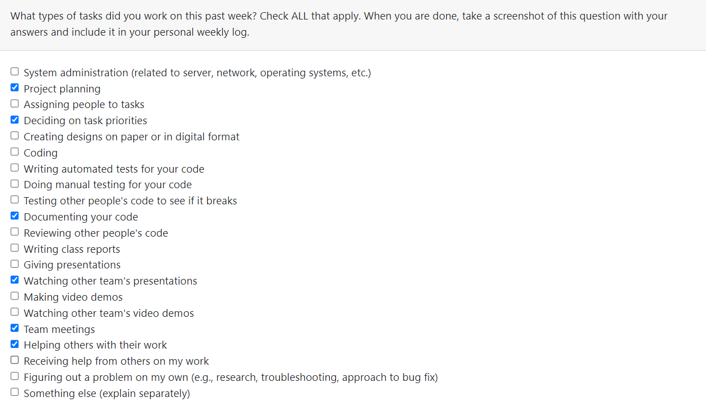

### Recap of personal goals

- Assisted in planning out our features for the upcoming milestone.
- Helped assign and prioritize tasks to be completed.
- Completed the individual report
- Completed the video demo 
- Completed the weekly logs.
- Updated and managed the Project Board.

### Tasks completed (from Project Board)

- Complete the individual report
    - Completed the system overview.
    - Completed the system architecture.
    - Completed the system features.
    - Completed the installation/set up instructions.
    - Completed the video demo.

- Complete the T2 W13 team log.
- Complete the T2 W13 individual log.
- Reviewed other team members' PRs and assigned team members to PRs.

### Tasks in progress (from Project Board)

- No tasks are currently in progress as all have been completed.

### Additional Information

N/A.
