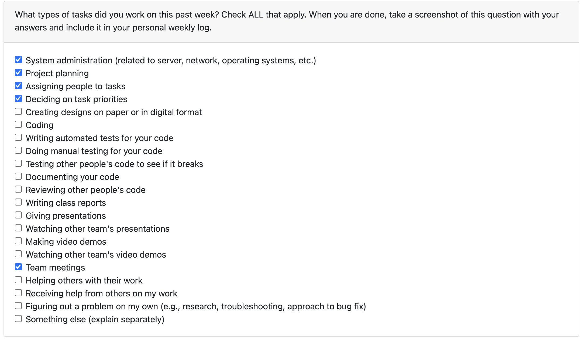
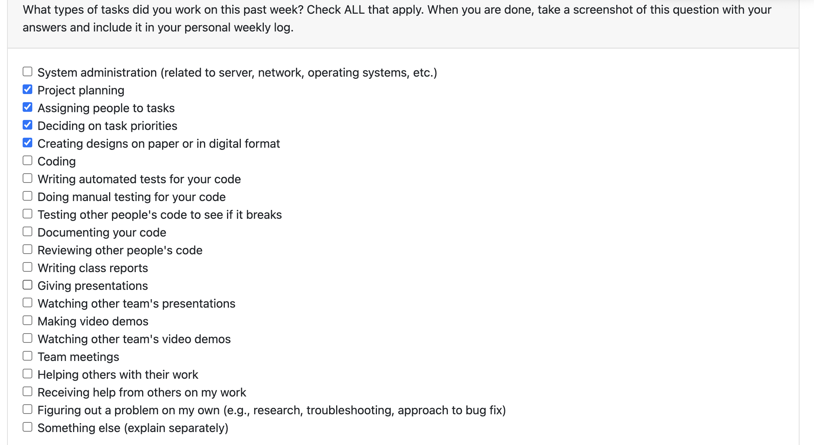
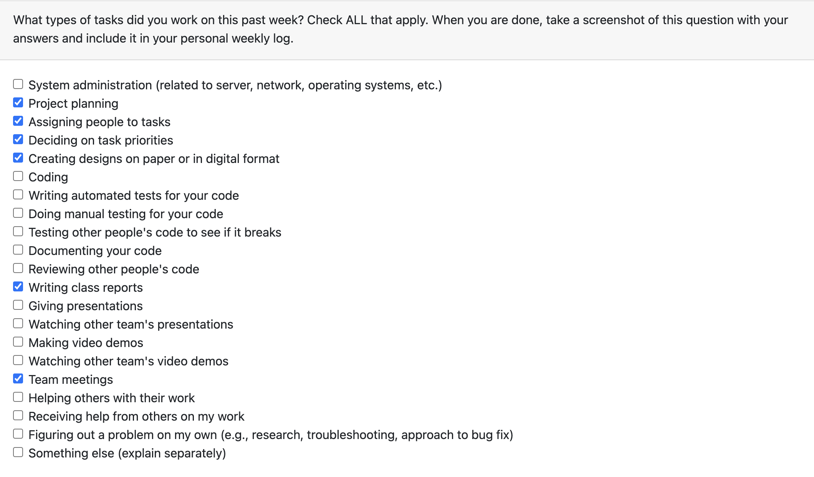
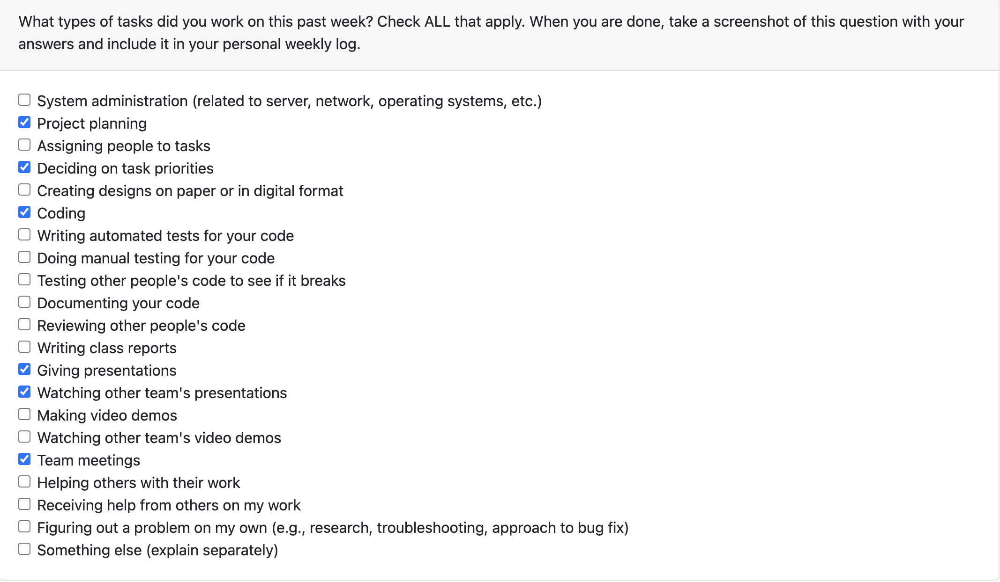
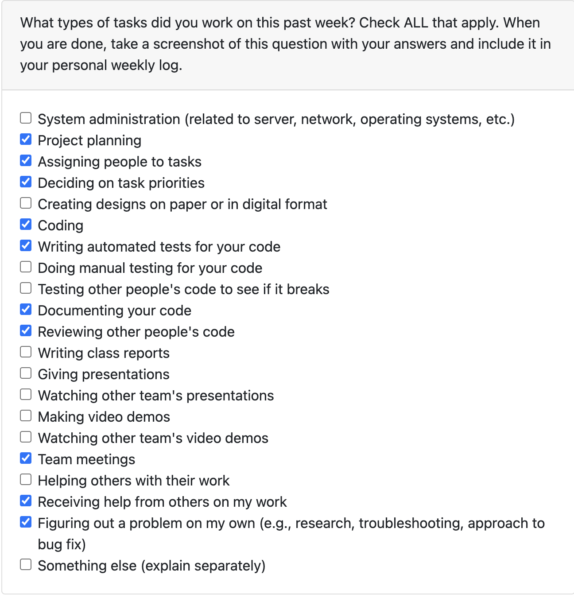
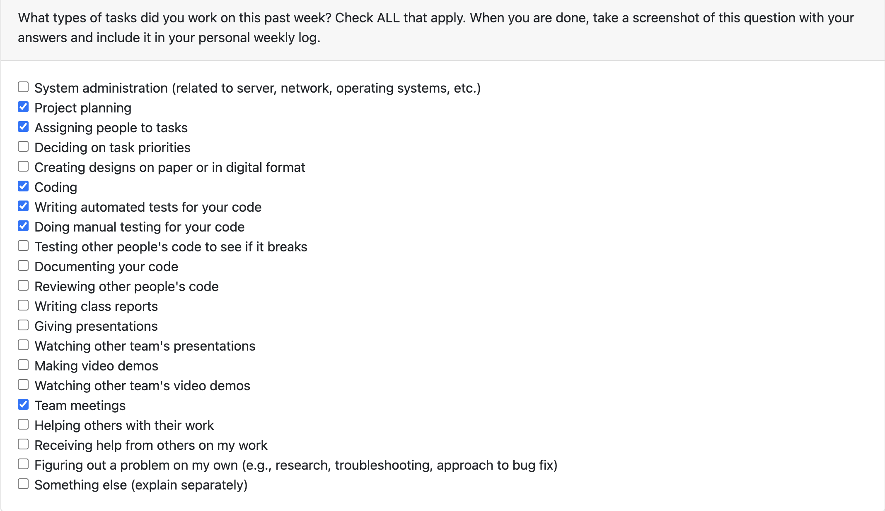
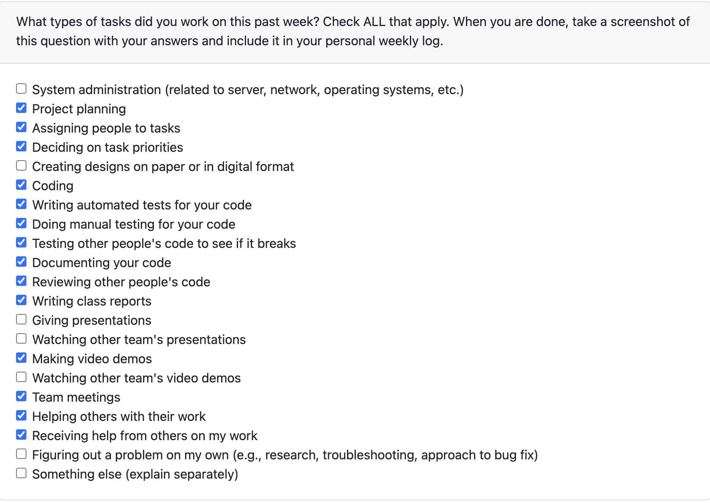
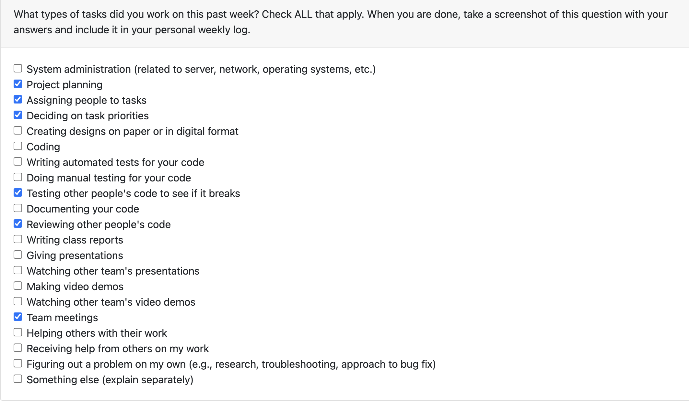

# Individual Log: Monday 25th Sept 2023 - Sunday 1st Oct 2023

## Tasks Worked On During the week

## Recap of goals
Work on planning the project

Work on assigning and prioritizing tasks

Attend weekly meetings

Write team log and documentation

## Tasks completed
Participated in project planning

Helped prioritize tasks and assign them to team members

Assigned people to, reviewed, and merged PRs from team members

Contributed to team log

## Tasks in progress
None

## Additional Information
None

# Individual Log: Monday 2nd Oct 2023 - Sunday 8th Oct 2023

## Tasks Worked On During the week

Recap of goals
* Discussed potential app names with team
* Planned app’s structure
* Created low-fidelity sketch of postings page of app
* Helped create and assign tasks
* Completed weekly log

Tasks completed
* Decide app structure
* Decide app UI
* Design the main page with all the food postings on Figma
* Assisted in assigning and prioritizing the tasks
* Reviewed other team members' PRs

Tasks in progress 
* No tasks currently

Additional Information

# Individual Log: Monday 9th Oct 2023 - Sunday 22nd Oct 2023

## Tasks Worked On During the week


Recap of goals
* Discussed app name further
* Helped workout app structure
* Assigned and prioritized tasks
* Designed the profile page on figma
* Designed the ratings page on figma
* Completed the weekly logs
  
Tasks completed (from Project Board)
  
* Decide app structure
* Decide app UI
* Complete team log
* Complete individual log
* Design the Profile page on Figma
* Design the ratings page on Figma
* Design the order completed page on Figma
  
Tasks in progress (from Project Board)
No task currently in progress as all have been completed.

Additional Information
N/A.

# Individual Log: Monday 23rd Oct 2023 - Sunday 29th Oct 2023

## Tasks Worked On During the week


Recap of goals

Managed and updated the project board.

* Decided on the app name.
* Helped plan the app structure further.
* Helped assign and prioritize tasks to be completed.
* Designed several pages of the app on Figma.
* Collaborated with team to discuss the presentation goals.
* Began learning and installed Flutter SDK onto my device.
* Added interactions to several pages on Figma to create a prototype.
* Helped design the donee workflow on Figma.
* Completed the weekly logs.

Tasks completed (from Project Board)

* Complete Week 8 Individual Log
* Complete Week 8 Team Log
* Finish presentation and practice it	
* Install Flutter SDK onto devices	
* Started learning Flutter	
* Add framework choices to the presentation	
* Create a donee workflow on Figma	

Tasks in progress (from Project Board)

No task currently in progress as all have been completed.

# Individual Log: Monday 30th Oct 2023 - Sunday 5th Nov 2023

## Tasks Worked On During the week

# Recap of goals

* Helped assign and prioritize tasks to be completed.
* Completed and rehearsed presentation with team.
* Evaluated and watched other team's presentations.
* Worked on the mapping feature
* Completed the weekly individual log.
* Created team log.

# Tasks completed (from Project Board)

* Worked on mapping feature and pushed to branch
* Complete team log for Week 9.
* Reviewed other team members' PRs and assigned team members to PRs.

# Tasks in progress (from Project Board)

No task currently in progress as all have been completed.

Additional Information 

N/A.

# Individual Log: Monday 6th Nov 2023 - Sunday 12th Nov 2023

## Tasks Worked On During the week

# Recap of goals

* Helped assign and prioritize tasks to be completed.
* Worked on UI for food item post page.
* Created UI test for food item post page.
* Completed the weekly individual log.
* Created gitignore file for everyone to start with
* Created team log.

# Tasks completed (from Project Board)

* Food details page and UI and widget test
* Add a .gitignore file
* Completed team log for the week
* Reviewed other team members' PRs and assigned team members to PRs.

# Tasks in progress (from Project Board)

No task currently in progress as all have been completed.

Additional Information 

N/A.

# Individual Log: Monday 13th Nov 2023 - Sunday 26th Nov 2023

## Tasks Worked On During the week

# Recap of goals

* Helped assign and prioritize tasks to be completed.
* Continued fixing bugs for food postings page
* Updated food postings page
* Completed the weekly individual log
* Created team log

# Tasks completed (from Project Board)

* Design tests for the food post detail feature
* Completed team log for the week
* Completed individual log
* Reviewed other team members' PRs and assigned team members to PRs.

# Tasks in progress (from Project Board)

* Complete the food post detail feature by adding functionality

Additional Information 

N/A.

# Individual Log: Monday 27th Nov 2023 - Sunday 3rd Nov 2023

## Tasks Worked On During the week

# Recap of goals

* Helped assign and prioritize tasks to be completed.
* Continued fixing bugs for food postings page
* Updated food postings page
* Created the backend for the posting detail page
* Created tests for the backend
* Completed the weekly individual log
* Created team log

# Tasks completed (from Project Board)

* Post details backend implementation reading data
* Modularize post-details code for efficiency
* Create a test for verifying correct document read for post-details
* Recap of features for design doc
* System architecture design for design doc
* Database design for design doc
* Created video for the milestone
* Completed team log for the week
* Completed individual log
* Reviewed other team members' PRs and assigned team members to PRs.

# Tasks in progress (from Project Board)
N/A

Additional Information 

N/A.

# Individual Log: Sunday 7th Jan 2024 - Sunday 14th Jan 2024

## Tasks Worked On During the week

# Recap of goals

* Helped assign and prioritize tasks to be completed.
* Completed the weekly individual log
* Created team log

# Tasks completed (from Project Board)

* Reviewed changes for food postings UI
* Continued fixing bugs for food postings page
* Completed team log for the week
* Completed individual log
* Reviewed other team members' PRs and assigned team members to PRs.

# Tasks in progress (from Project Board)
N/A

Additional Information 

N/A.

