# Individual Log: Monday 25th Sept 2023 - Sunday 1st Oct 2023

## Tasks Worked On During the week

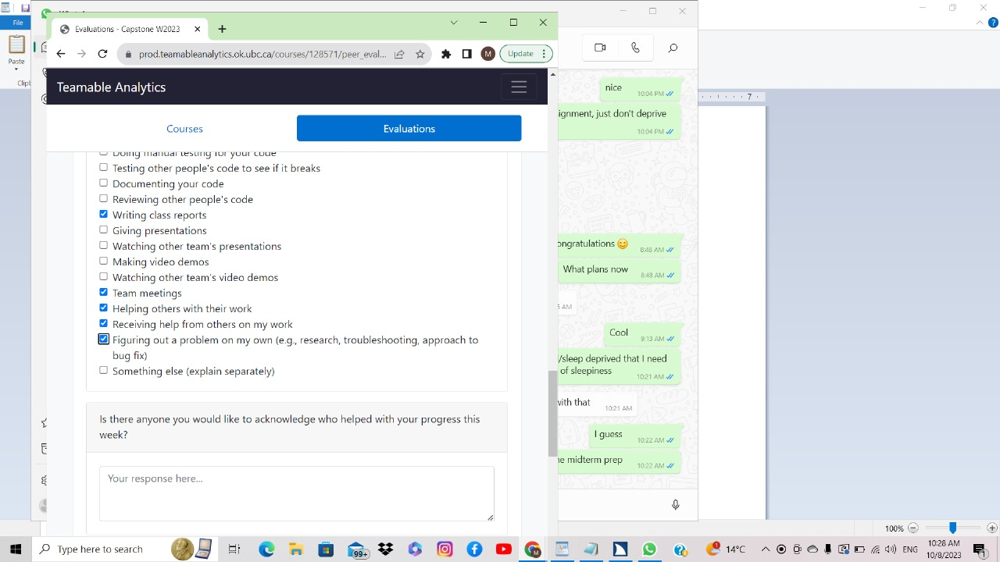

## Recap of goals
- Planning the project and its scope.
- Help assign and prioritize tasks to be completed.
- Setup project repository.
- Complete the project plan document.
- Complete the weekly logs.

## Tasks completed
- Participated in project planning with the team.
- Helped complete the project plan documentation - Overview, Individual Strengths and Weaknesses, Envisioned Usage, Major Milestones, Technology Stack, and Teamwork Distribution.
- Assisted in assigning and prioritizing the tasks.
- Reviewed other team members' PRs and assigned team members to PRs.
- Contributed to the team log.

## Tasks in progress
None

## Additional Information
None

## Weeks 6 and 7: Monday 9th Oct 2023 - Sunday 22nd Oct 2023

### Tasks Worked On During the week

### Recap of goals

- Collaborated with team to discuss the app name.
- Helped plan the app structure further.
- Helped assign and prioritize tasks to be completed.
- Designed several pages of the app on Figma.
- Worked on the database UML diagram
- Setting up Firebase
- Setting up realtime database on firebase
- Enabling authentication on firebase server

### Tasks completed (from Project Board)

- Design the "add post" page on Figma	
- Design the settings page on Figma and create detailed flows	
- Design the chat page on Figma	
- Design the public profile page on Figma	
- Reviewed other team members' PRs and assigned team members to PRs.

### Tasks in progress (from Project Board)

No task currently in progress as all have been completed.

### Additional Information

N/A.

## Week 8: Monday 23rd Oct 2023 - Sunday 29th Oct 2023

### Tasks Worked On During the Week

### Recap of goals

- Decided on the app name.
- Helped assign and prioritize tasks to be completed.
- Collaborated with team to discuss the presentation goals.
- Rehearsed the live-demo for the presentation.
- Completed the weekly logs.
- Setup firebase authentication with email/password
- Setup email verification on firebase
- Setup multiple screens in flutter
- Flutter tests, automated generated reports for the same
- Debugging firebase

### Tasks completed (from Project Board)

- Completed the weekly logs.
- Setup firebase authentication with email/password
- Setup email verification on firebase
- Setup multiple screens in flutter
- Flutter tests, automated generated reports for the same
- Debugging firebase
- Finish presentation and practice it.
- Reviewed other team members' PRs and assigned team members to PRs.

### Tasks in progress (from Project Board)

No task currently in progress as all have been completed.

### Additional Information

N/A.

## Week 9: Monday 30th Oct 2023 - Sunday 5th Nov 2023

### Tasks Worked On During the Week
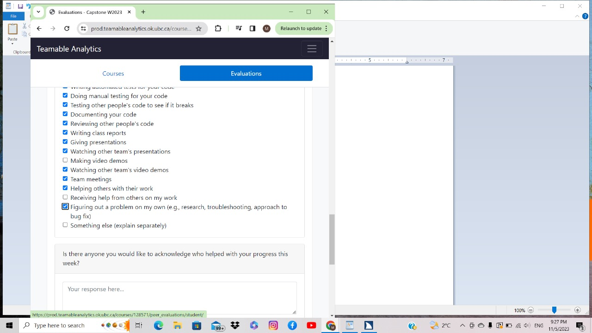
### Recap of goals
- Helped the team to make presentation 
- Worked on the project specific part of the presentation 
- Prepared for and gave the presentation
- Watched and assessed other team's presentation
- Discussed and prioritise tasks 
- Worked on the test for signup mock 

### Tasks completed (from Project Board)
-work on signup and login
-Made the authentication wrapper and rerouting based on authentication
- Complete team log for W9
- Complete individual log for W9

### Tasks in progress (from Project Board)
None

##week 10

### Tasks Worked On During the Week

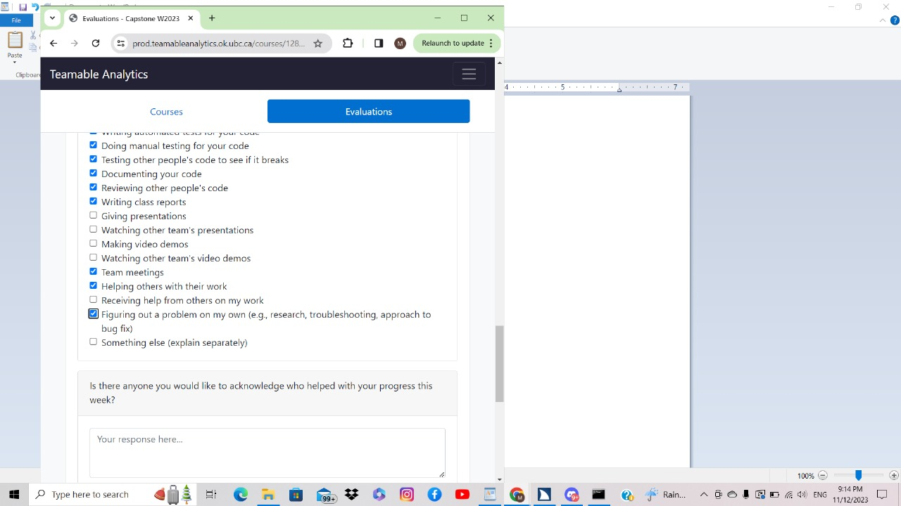

### Recap of personal goals

- Assisted in planning out our features for the upcoming milestone.
- Helped assign and prioritize tasks to be completed.
- Completed the weekly logs.
- Implemented logout feature
- Implemented email verification
- Updated cloud firestores rules to allow authenticated and authorized users to read/write from the database
- Error resolution in teammates' code

### Tasks completed (from Project Board)

- Added email verification using a dynamically generated link from a no-reply email of our project
- Created the logout button and implemented its functionality
- Rewrote cloud firestore rules on the firebase console
- Resolved the error to log a user out if a user's information does not exist (and remove cache from app)
- Manually tested the code and fixed bugs.
- Complete Week 10 individual log
- Assisted in planning out the features left for the milestone and the tasks associated with them.
- Reviewed other team members' PRs and assigned team members to PRs.

### Tasks in progress (from Project Board)

No task currently in progress as all have been completed.

### Additional Information

N/A.

##week 11 and 12

### Tasks Worked On During the Week

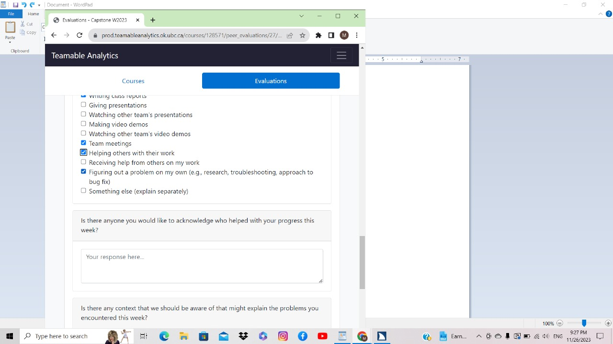

### Recap of personal goals

- Assisted in planning out our features for the upcoming milestone.
- Helped assign and prioritize tasks to be completed.
- Completed the weekly logs.
- Updated cloud firestores rules to allow authenticated and authorized users to read/write from the database more securely
- Error resolution in teammates' code
- Created public_page, where a user's public information is viewable
- Wrote functions to read, write, query and dynamically generate IDs for documents on firestore

### Tasks completed (from Project Board)

- Updated cloud firestore rules on the firebase console
- Manually tested the code and fixed bugs.
- Manually tested and fixed bugs in other team members' code
- Completed Week 12 individual log
- Assisted in planning out the features left for the milestone and the tasks associated with them.
- Reviewed other team members' PRs and assigned team members to PRs.
- Created public_page, where a user's public information is viewable
- Wrote functions to read, write, query and dynamically generate IDs for documents on firestore

### Tasks in progress (from Project Board)

No task currently in progress as all have been completed.

### Additional Information

N/A.

##week 13

### Tasks Worked On During the Week

### Recap of personal goals

- Assisted in planning out our features for the upcoming milestone.
- Helped assign and prioritize tasks to be completed.
- Completed the weekly logs.
- debugging code
- Worked on the database design
- Attended group meetings

### Tasks completed (from Project Board)

- fixed bugs in code
- Completed Week 13 individual log
- Assisted in planning out the features left for the milestone and the tasks associated with them.
- Reviewed other team members' PRs and assigned team members to PRs.
- Worked on the database design

### Tasks in progress (from Project Board)

No task currently in progress as all have been completed.

### Additional Information

N/A.

---

## Term 2 Week 1: Monday 8th Jan 2023 - Sunday 14th Dec 2023

### Tasks Worked On During the Week

### Recap of personal goals
- Planning the team meeting to start the project again 
- Helped prioritise the task
- Worked through my previous code to get a catchup 
- Looked into accessibility (particularly screenreader use, including alt text and labels)
- Completed logs for the week

### Tasks completed (from Project Board)
- Tested accessibility of pages and
- Reviewed code of others
- Complete Week 13 team log.
- Complete Week 13 individual log.
- Reviewed other team members' PRs and assigned team members to PRs.

### Tasks in progress (from Project Board)

- No tasks currently in progress as all have been completed.

### Additional Information

N/A.

## Term 2 Week 2

### Tasks Worked On During the Week

### Recap of personal goals
- Helped prioritise the task
- Modified code in public_page, account_page, settings_page, postViewModel, profile_card and posting_page files
- connected posting_page to public_page
- debugging code
- Completed logs for the week

### Tasks completed (from Project Board)
-completed the linking of posts with public profiles
-made alterations to previous code in several files
- Complete Week 14 individual log.

### Tasks in progress (from Project Board)

- debugging the linking code, works sometimes and glitches out other times (the screen hangs)

### Additional Information

N/A.

-------------------

## Term 2 Week 3

### Tasks Worked On During the Week
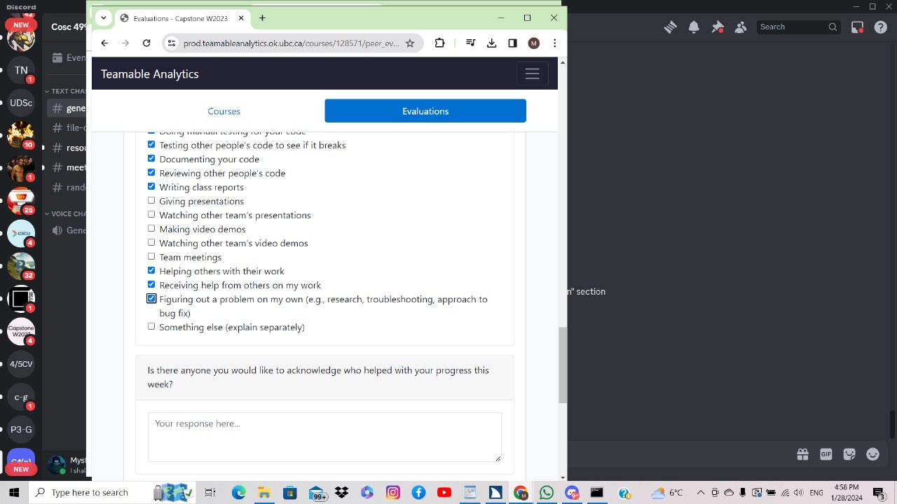
### Recap of personal goals
- Helped prioritise the task
- modified code in edit_profile page, android manifest, pubspec among other files
- created storage system on firebase
- Defined rules for storage
- modified rules for authentication and datastorage
- debugging code
- Helped others with back end structure and organization
- Completed logs for the week

### Tasks completed (from Project Board)
- Completed image handling and uploading to storage (on android)
-rewrote rules for storage, authentication and database on firebase
-made alterations to previous code in several files
- Completed Week 15 individual log.

### Tasks in progress (from Project Board)

N/A, all is complete

### Additional Information

N/A.

## Term 2 Week 4

### Tasks Worked On During the Week
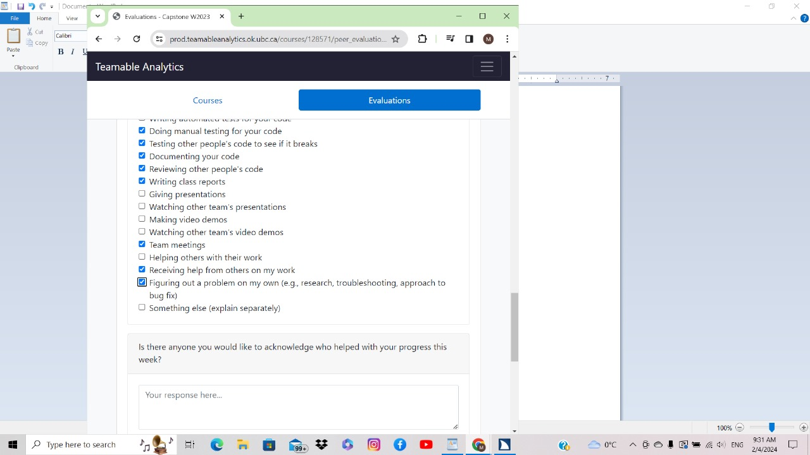
### Recap of personal goals
- Helped prioritise the task
- modified code in register_screen
- created a confirm password field
- modified form validation rules
- improved alerts for any problems the registration form may have for clearer communication
- debugging code
- Completed logs for the week

### Tasks completed (from Project Board)
- edited register_screen code
- added confirm password field and supporting rules for validation
- created alerts and pop-ups to let the user know about any problems with the form (missing fields, weak password, password doesn't match confirm password, etc)
- Completed Week 16 individual log.

### Tasks in progress (from Project Board)

N/A, all is complete

### Additional Information

N/A.

## Term 2 Week 5

### Tasks Worked On During the Week
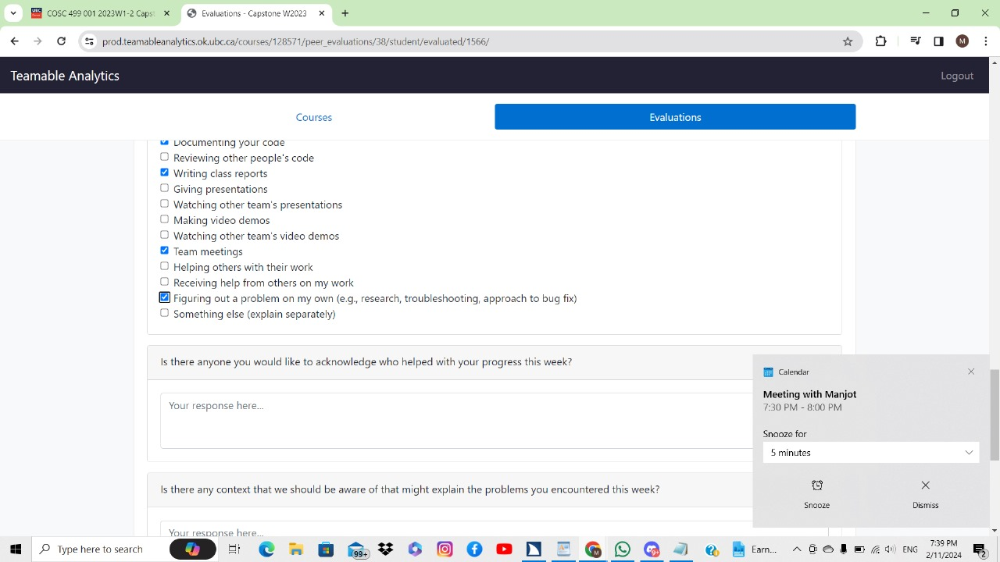
### Recap of personal goals
- Helped prioritise the task
- modified code in register_screen
- modified password validation rules
- enforced more secure/stronger passwords
- improved alerts for any problems the registration form may have for clearer communication
- debugging code
- Completed logs for the week

### Tasks completed (from Project Board)
- edited register_screen code
- Added alert/pop-up for weak password, and how to make it stronger
- enforced stronger/more secure password rules
- Completed Week 17 individual log.

### Tasks in progress (from Project Board)

N/A, all is complete

### Additional Information

N/A.

## Term 2 Week 6

### Tasks Worked On During the Week
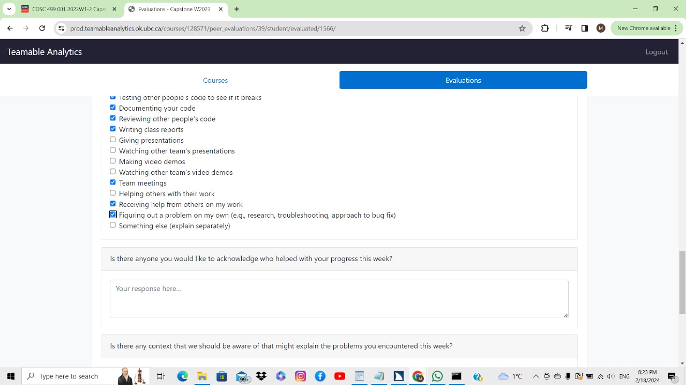
### Recap of personal goals
- Helped prioritise the task
- modified code in register_screen
- modified password validation rules UI
- created the server-side (firebase) collection, documents and rules for user messaging
- edited code in message_screen for messaging between users
- debugging code
- Completed logs for the week

### Tasks completed (from Project Board)
- edited register_screen code
- updated password rules UI
- created rules, collection and documents for messaging
- Completed Week 18 individual log.

### Tasks in progress (from Project Board)

- updating code in message_screen, all is complete

### Additional Information

N/A.

## Term 2 Week 9 (March 4-10)

### Tasks Worked On During the Week
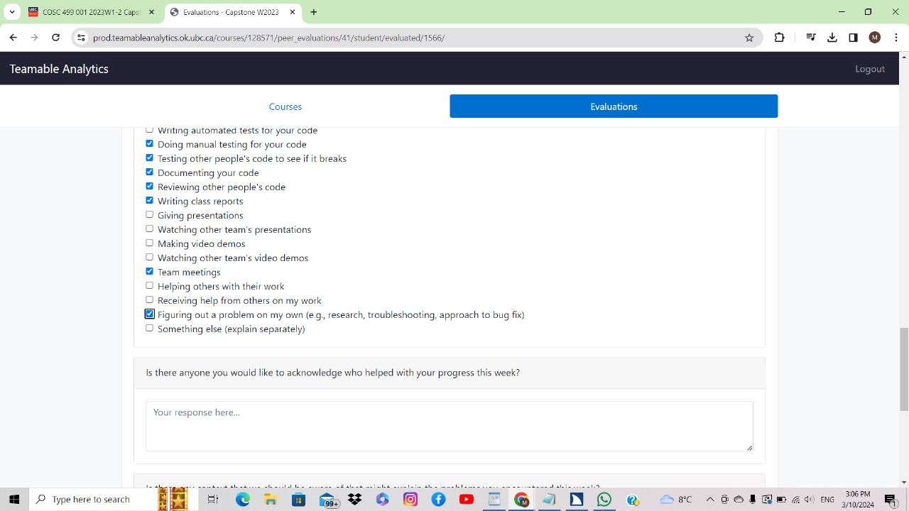
### Recap of personal goals
- Helped prioritise the task
- modified code in register_screen
- edited code in login screen
-added functionality to show/hide password on both screens, as well as for confirm password screen for registration screen
- debugging code
- Completed logs for the week

### Tasks completed (from Project Board)
- edited register_screen code
- updated code in login screen
- added buttons to hide/show password in both screens
- Completed Week 21 individual log.

### Tasks in progress (from Project Board)

- none

### Additional Information

N/A.

## Term 2 Week 10

### Tasks Worked On During the Week
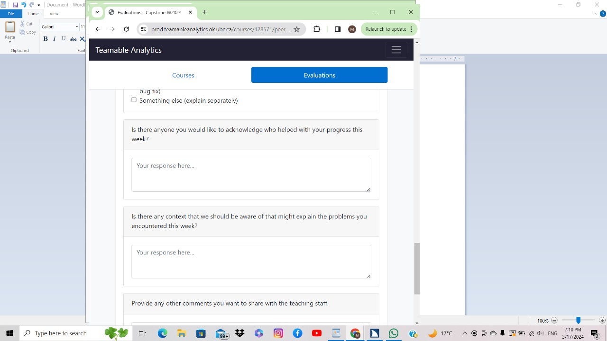
### Recap of personal goals
- Helped prioritise the task
- modified code in settings_screen and implemented delete account feature
-updated android/build.gradle file to update ext.katlin version for compatibility
- updated android/app/build.gradle to update android sdk, min sdk and other dependencies for compatibility issues
- cleaned out and rebuilt dependency files
- debugging code
- Completed logs for the week

### Tasks completed (from Project Board)
- added delete account functionality
- updated kotlin, android sdk, min sdk and other requirements and metadata alongside some packages to resolve compatibility issues on android devices
- Completed Week 22 individual log.

### Tasks in progress (from Project Board)

- none

### Additional Information

N/A.

## Term 2 Week 12

### Tasks Worked On During the Week
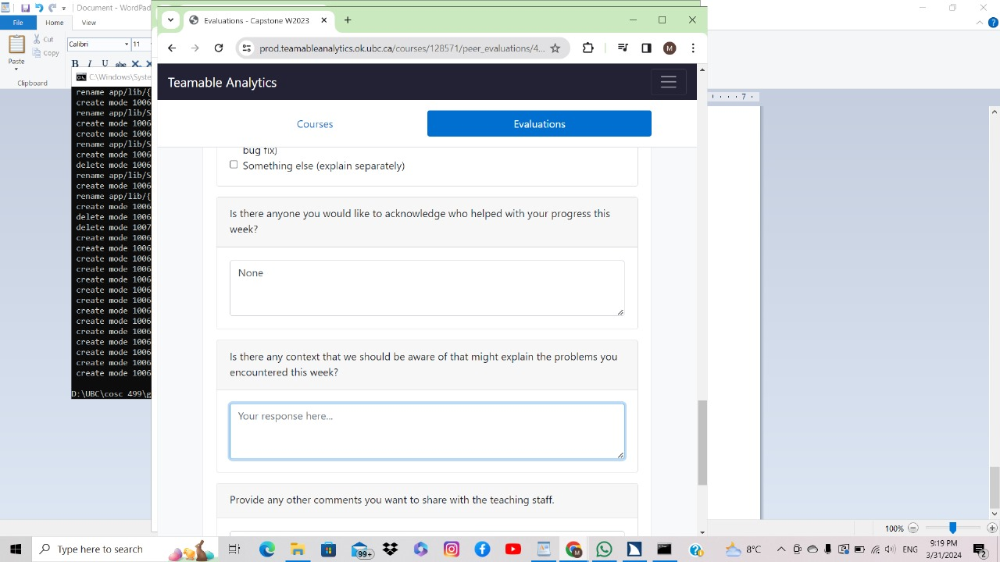
### Recap of personal goals
- Helped prioritise the task
- modified code in settings_screen and implemented delete account feature
- updated libraries and sdks
- updated back end connectivity to update documents to reflect when an account has been deleted
- Completed logs for the week

### Tasks completed (from Project Board)
- added delete account functionality
- increased functionality for back end updates
- Completed Week 24 individual log.

### Tasks in progress (from Project Board)

- none

### Additional Information

N/A.