# Individual Log

# Week 4: Monday 25th Sept 2023 - Sunday 1st Oct 2023

## Tasks Worked On During the week

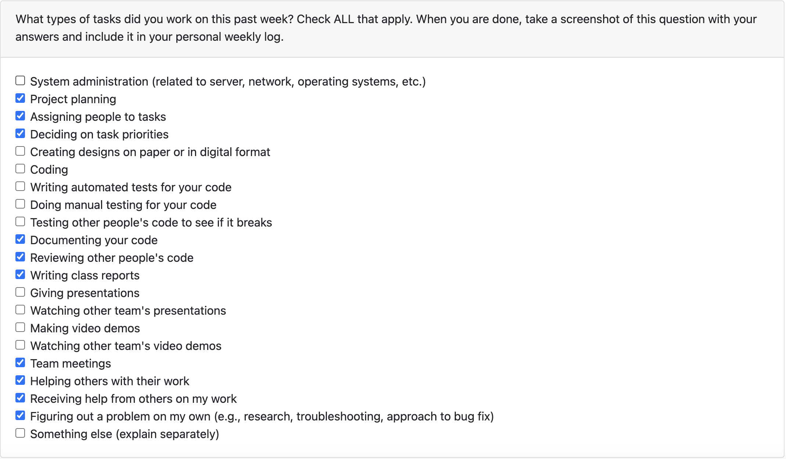

## Recap of goals

- Contributed in writing up the project proposal
- Contributed to documentation
- Reviewed and merged pull request from team members
- Revised and updated the project proposal
- Contributed on deciding on the Tech stacks and goals for the project
- Planned out and assigned tasks to team members for the year long project

## Tasks completed

- Attending weekly meetings
- Contributing to documentation
- Merged and reviewed PRS from team members
- Completed and fully revised the project proposal

## Tasks in progress

N/A

## Additional Information

N/A

# Week 5: Monday 2nd Oct 2023 - Sunday 8th Oct 2023

## Tasks Worked On During the week

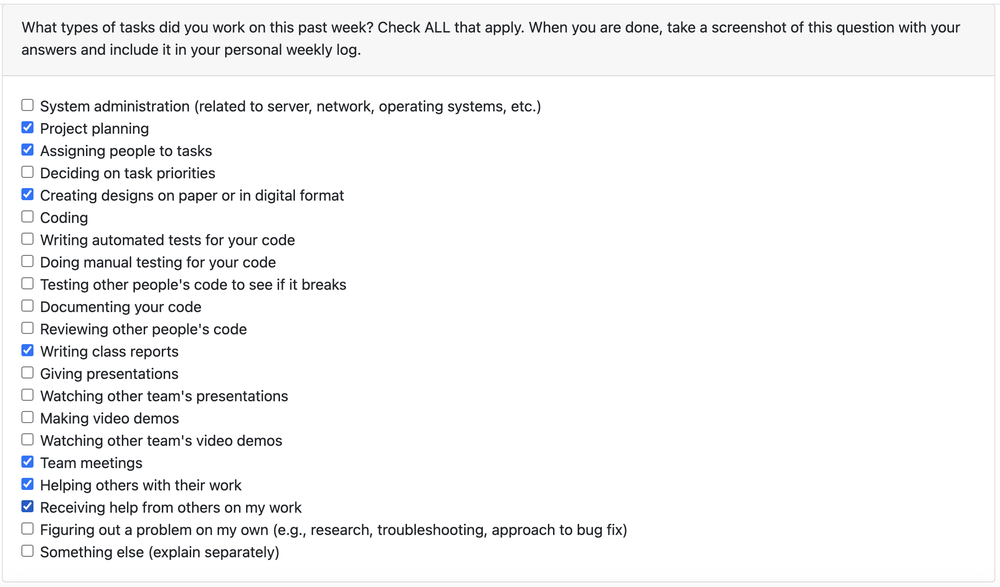

## Recap of goals

- Contributed in formulating some potential app names for our app.
- Created a Low-fi wireframing of the app structure.
- Helped deciding on the feature of the app and the placement of those features.
- Created a resource library on Figma for the team to use.
- Created high-fi wireframes of the registration process on Figma.
- Completed the weekly log.

## Tasks completed

- Create low-fi wireframes
- Create high-fi wireframes for the registration process on Figma
- Create a resource library on Figma for the team.
- Assisted in assigning and prioritizing the tasks.
- Created the basic lofi wireframe for the app.
- Merged and revised PRS from team members
- Completed the weekly log.

## Tasks in progress (from Project Board)

N/A

## Additional Information

N/A

## Weeks 6 & 7: Monday 9th Oct 2023 - Sunday 22nd Oct 2023

## Tasks Worked On During the week

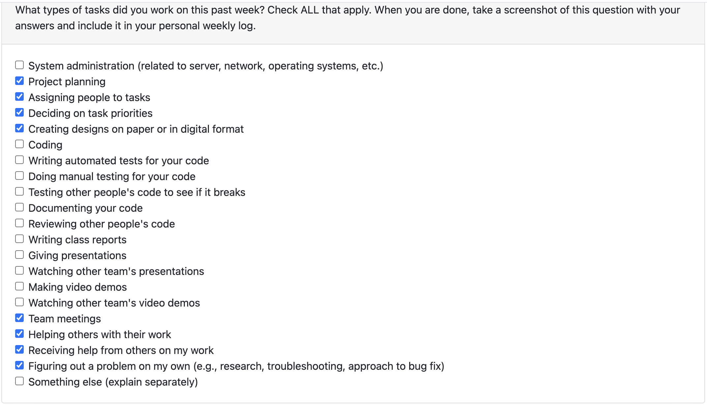

## Recap of goals

- Refined the app designed to make pages more consistent.
- Structured detailed layouts and wireframes.
- Created modular animations and transitions across different pages on Figma while prototyping, while ensuring the consistency of the UI elements.
- Reviewed and check ER diagrams to ensure the database structure matches the app design.
- Learned the basics of flutter and installed Flutter/Dart SDKs on my local machine.
- Completed the workflow diagram for the app.
- Attended weekly meetings and writing up the individual log.

## Tasks completed

- Reviewed and completed the most of the design workflows on Figma, including the discover, post, map, search, order completion, profile edit, gallery, search and the registration workflows.
- Completed the prototype of the app on Figma, including the animations and transitions.
- Reviewed and checked the ER diagrams to ensure the database structure matches the app design.
- Assisted in assigning and prioritizing the tasks.
- Created a basic splash screen for the app.
- Installed and tested Flutter/Dart SDKs on my computer.
- Merged and revised PRS from team members.
- Completed the weekly log.

## Tasks in progress (from Project Board)

N/A

## Additional Information

N/A

## Weeks 8: Monday 23th Oct 2023 - Sunday 29nd Oct 2023

## Tasks Worked On During the week

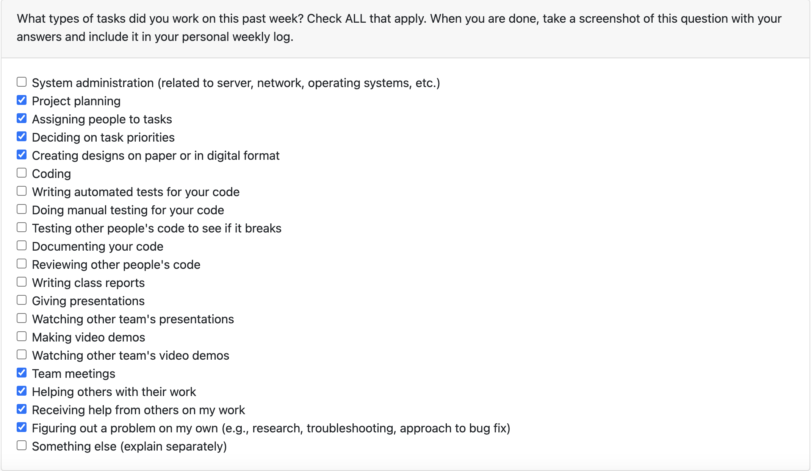

## Recap of goals

- Review other's figma layouts and make the pages more consistent.
- Create the slide template for the presentation.
- Contributed to the adding details to the presentation slides.
- Add more details to the flows to the Figma demo.
- Practices and rehearsed the demo for the presentation.
- Attended weekly meetings and writing up the individual log.

## Tasks completed

- Finalized Figma design workflows for all app features.
- Added animations and transitions to Figma prototype.
- Conducted peer reviews on Figma layouts for consistency.
- Created and populated presentation slide template.
- Practiced and rehearsed demo for upcoming presentation.
- Attended weekly meetings and completed individual log.
- Assisted in task assignment and prioritization.
- Installed  and learnedFlutter/Dart SDKs, tested locally.
- Reviewed, merged, and revised PRs from team members.

## Tasks in progress (from Project Board)

N/A

## Additional Information

N/A

## Week 9: Monday 30th Oct 2023 - Sunday 5th Nov 2023

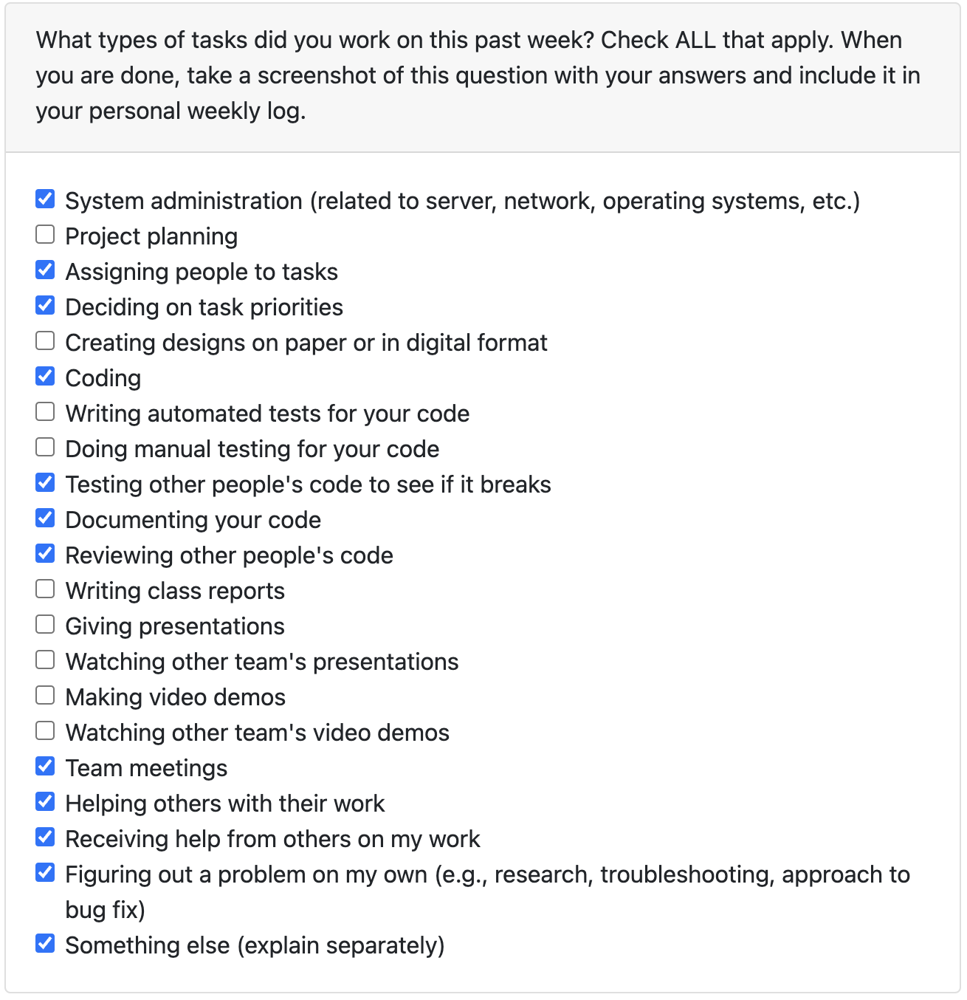

## Recap of goals

- Presented the first demo for the app in the presentation
- Import resources from Figma to our Flutter project.
- Managed Flutter Packages and dependencies for the app project.
- Created and contributed in making splash, login, and registration pages for the app.
- Created the welcome screen for the app.
- Ensure the navigation between pages flows as expected.
- Contributed integrating the Firebase Authentication and Firestore into the existing UI structure.

## Tasks completed

- Help assign tasks to team members.
- Created the welcome screen for the app.
- Created the splash screen for the app.
- Created Google Maps API key and integrated into the existing package.
- Reviewed and merged PRs from team members.
- Contributed in integrating Firebase Authentication and Firestore into the existing UI structure.
- Attended weekly meetings and completed individual log.
- Presented the demo for the app.

## Tasks in progress (from Project Board)

N/A

## Additional Information

N/A

## Week 10: Monday 6th Oct 2023 - Sunday 12th Nov 2023

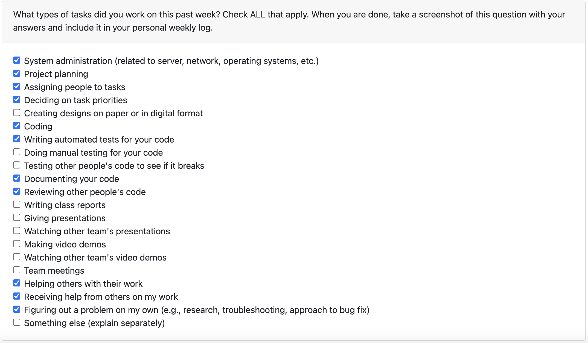

## Recap of goals

- Building the Order page UI and layout behaviours.
- Implementing the components of the Order page.
- Added widgets to the Order page.
- Reported the testing results of the Order page.
- Contributed to building the teamlog for the week.
- Helped review and suggest changes to the other team members' PRs and code.
- Ensured code consistency and created guidelines for the team.

## Tasks completed

- Finalize UI/UX for Order page.
- omplete integration of all components on Order page.
- Ensure widgets are fully functional and user-friendly.
- Conduct thorough testing, fix bugs.
- Update teamlog with detailed progress and challenges.
- Review team members' contributions critically.
- Enforce and refine code guidelines for consistency.
- Prepare for next phase of implementing the account screen.

## Tasks in progress (from Project Board)

N/A

## Additional Information

N/A

## Week 11 & 12: Monday 13th Oct 2023 - Sunday 26th Nov 2023

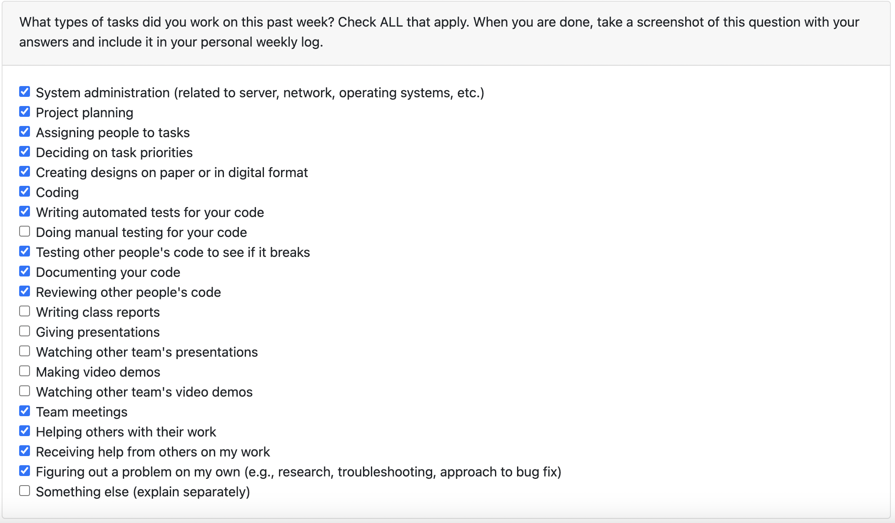

## Recap of goals

- Building the Account page UI and layout behaviours.
- Implementing the components of the Account page.
- Added widgets to the Account page.
- Reported the testing results of the Account page.
- Contributed to building the teamlog for the week.
- Helped review and suggest changes to the other team members' PRs and code.
- Ensured code consistency and created guidelines for the team.

## Tasks completed

- Fetched account info from profile (only email for now bc other info are not associated with an account)
- Photo picker for profile photo
- Location Pickers -> Provinces and cities can be fetched from fb as well, and updatable.
- Segmented view for the order page
- Empty placeholder view for when the order is empty
- Context Menu when pressed on an order with quick action like edit/remove order from history
- Refined order/post components
- Added Widget tests
- Resolved bugs and added other feature improvements, like page scrolling behaviour and bottom tab bar etc

## Tasks in progress (from Project Board)

N/A

## Additional Information

N/A

## Week 13: Monday 27th Oct 2023 - Sunday 3rd Dec 2023

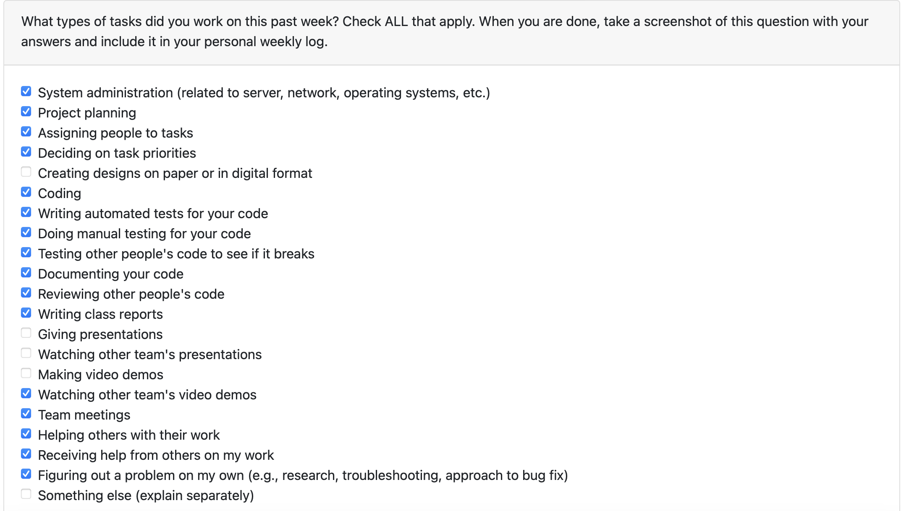

## Recap of goals

- Profile card now updates and listen for changes from the Firebase.
- Orders from profile now fetches from firebase
- Linked views between order and order detail view
- Loading indicators when fetching from the fb
- Pickers now uses stored values from firebase
- Implemented edge case when there's no posts, placeholders etc.
- Mock firebase test for the functionalities
- Resolve other UI bugs
- Contributed to building the teamlog for the week.
- Helped review and suggest changes to the other team members' PRs and code.
- Ensured code consistency and created guidelines for the team.
- Helped with the presentation slides and demo.
- Helped with writing up the design document.

## Tasks completed

- The profile card has been updated to synchronize with Firebase changes.
- Orders are now retrieved from Firebase.
- Linked views have been established between the order list and order detail view.
- Loading indicators have been added for better user experience during Firebase data retrieval.
- Pickers now utilize values stored in Firebase.
- Special consideration has been given to handling cases where there are no posts, using placeholders, and similar scenarios.
- Mock Firebase tests have been created to validate functionality.
- Various UI bugs have been addressed and resolved.
- Contribution was made to the weekly team log.
- Assistance was provided in reviewing and suggesting improvements for team members' Pull Requests and code.
- Ensured code consistency and established guidelines for the team.
- Assisted in creating presentation slides and preparing the demo.
- Contributed to the development of the design document.

## Tasks in progress (from Project Board)

N/A

## Additional Information

N/A

## Term 2 Week 1: Monday 8th Jan 2024 - Sunday 14th Dec 2024

### Tasks Worked On During the Week

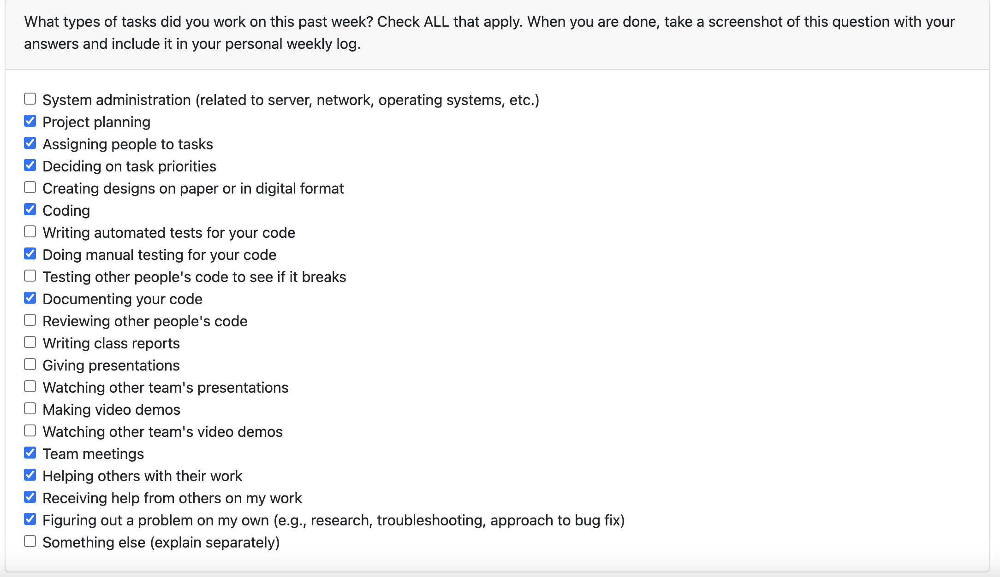

### Recap of personal goals

- Reworked post detail page and introduced additional widgets to improve UI.
- Implemented the Browse screen UI with Google Maps integration.
- Improved code quality and consistency.
- Reworked settings page to improved Dark Mode appearance.
- Seperated out multiple pages into viewmodels and widgets.
- Completed the weekly logs.
- Assisted in assigning and prioritizing the tasks for the upcoming milestone.

### Tasks completed (from Project Board)

- Upgraded Post Detail page UI with new widgets.
- Created Browse screen UI with Google Maps.
- Enhanced code quality and consistency.
- Improved Dark Mode on Settings page.
- Refactored pages into viewmodels and widgets.
- Compiled weekly logs.
- Helped writing up team log for the week.
- Helped in task assignment and prioritization for next milestone.

### Tasks in progress (from Project Board)

- No other tasks currently in progress.

### Additional Information

N/A.

## Term 2 Week 2: Monday 15th Jan 2024 - Sunday 21th Dec 2024

### Tasks Worked On During the Week

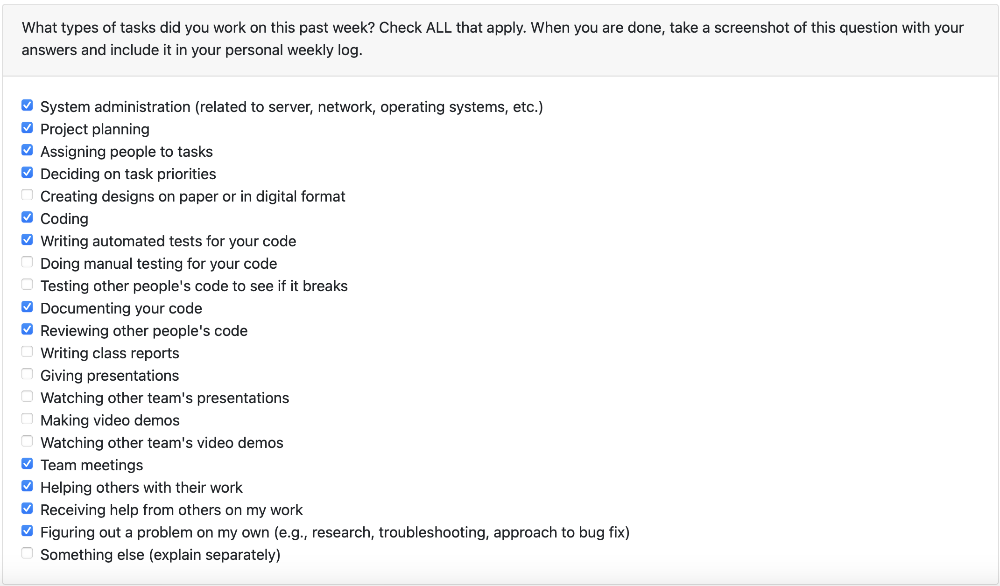

### Recap of personal goals

- Updated Google Maps to display nearby posts, enhancing user interaction.
- Integrated zoom animations for map pins to improve map usability.
- Developed a filter control sheet for post selection based on date range, categories, and time.
- Implemented a range indicator for map view.
- Added gesture controls for the map view.
- Supported Dark Mode in both the browse screen and saved screen.
- Implemented backend logic for saving posts.
- Added snackbar notifications for post save/unsaved actions.
- Conducted widget tests to ensure reliability and performance.
- Completed the weekly logs.
- Assisted in assigning and prioritizing the tasks for the upcoming milestone.

### Tasks completed (from Project Board)

- Google Maps update with nearby post display and zoom animations.
- Filter control sheet for post selection.
- Range indicator and gesture controls in map view.
- Post card component modifications for browse screen.
- Cancel button for textfield and Dark Mode support in new features.
- Backend logic for saving posts.
- Snackbar notifications for post actions.
- Saved page account association.
- UI state management for different post scenarios.
- Widgets testing and Dark Mode enhancements.

### Tasks in progress (from Project Board)

- No other tasks currently in progress.

### Additional Information

N/A.

## Term 2 Week 3: Monday 22th Jan 2024 - Sunday 28th Dec 2024

### Tasks Worked On During the Week

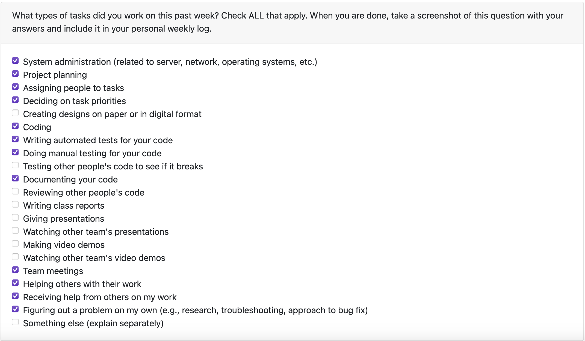

### Recap of personal goals

- Continued to work on the browse screen and other performace improvements.
- Added backend logic when posting a new post and display the pickup location correctly on the map.
- Worked on fixing overflow issues that appeared on the detail screen.
- Troubleshot and fixed the issue with the map not displaying when launching the app on an android device.
- Fixed the bug related to gesture controls where one map cannot pan when embedded in a scrolled view.
- Added many dark mode support throughout the app.
- updated widgets tests for both new post and browse screens.

### Tasks completed (from Project Board)

- updated new post screen with a location picker allowing user to select the pick up location
- updated Google Maps version and Podfiles, the map should works fluidly with the latest version of iOS
- introduced limits on map, the user can only zoom with a predefined range
- fixed permission & blanked screen on Android
- revamped several ui components on the new post screen
- pickers in the new post screen should now appears in a modal sheet, eliminating the overflow errors
- maps should now defaults to current location
- cards in the browse screen are now compact sized
- fixed the gesture controls where one map cannot pan when embedded in a scrolled view
- new post screen should now adapts to dark mode
- updated marker styles
- several ui hotfixes and added overflow control on the card views
- updated widgets tests for both new post and browse screens

### Tasks in progress (from Project Board)

- No other tasks currently in progress.

### Additional Information

N/A.

## Term 2 Week 4: Monday 29th Jan 2024 - Sunday 4th Feb 2024

### Tasks Worked On During the Week

### Recap of personal goals

- Fixed the bug where province and city weren't recorded once user registers.
- Added backend/frontend logic to post images on the app, including the post images and profile images.
- Added sign in with Google and Apple ID for the app.
- Added new email templates for forgot password and reset password.
- Fix the bug where the page constantly refreshes on the bookmarked page.
- Login screen and registration screen should now prompt the user to correct their input if it's invalid.
- Attened weekly meetings and completed the weekly log.
- Assisted in assigning and prioritizing the tasks for the upcoming milestone.
- Helped review and suggest changes to the other team members' PRs and code.
- Attended peer evals and hosted stations for the team.
- Ensured code consistency and created guidelines for the team.

### Tasks completed (from Project Board)

- Updated the visual appearance of the login and registration screens to improve accessibility.
- Addressed the issue where the province and city were not properly recorded when a user registered.
- Implemented both backend and frontend functionality for uploading images within the app, including both post images and profile pictures.
- Incorporated the option for users to sign in using their Google and Apple ID credentials.
- Introduced new email templates to enhance the user experience for forgot password and password reset functionalities.
- Resolved the bug that caused continuous refreshing of the bookmarked page.
- Enhanced the login and registration screens to provide users with error prompts if their input is invalid.

### Tasks in progress (from Project Board)

- No other tasks currently in progress.

### Additional Information

N/A.

## Term 2 Week 5: Monday 5th Feb 2024 - Sunday 11th Feb 2024

### Tasks Worked On During the Week

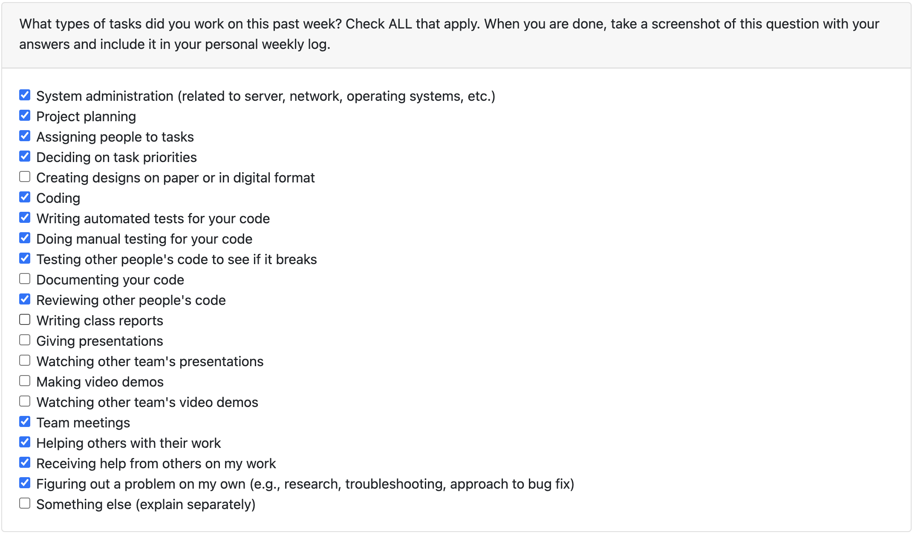

### Recap of personal goals

- Added and updated the UI for the Public Profile page.
- Redesign the order post card to better present the status of the order.
- Reorganized the account screen and the settings page to improve the logic of each page.
- Implemented the backend logic for the future implementation of push notifications.
- Added weekly logs and contributed to the team log.
- Reviewed and merged PRs from team members.

### Tasks completed (from Project Board)

- Configured Push Notifications APNs for iOS and FCM for Android.
- Refreshed Public Profile page with a colour matched gradient.
- Added recent posts and reviews to the Public Profile page.
- Redesigned the order post card to better present the status of the order.
- Migrated the Edit Profile buttons to the Settings screen.
- Fixed laggy performance issues when scrolling down the page by removing shadows for the card.
- Cleaned up issues and warnings in the project.
- Completed weekly Log and contributed to the Team Log.

### Tasks in progress (from Project Board)

- No other tasks currently in progress.

### Additional Information

N/A.

## Term 2 Week 6: Monday 12th Feb 2024 - Sunday 18th Feb 2024

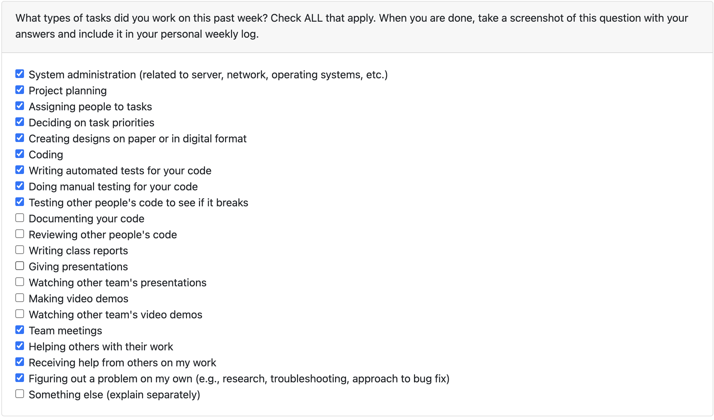

### Tasks completed (from Project Board)

- Added feature for the mulitple image upload for the post and gallery view of the post.
- Added the backend logic for image upload and gallery view.
- Refactored the code further to make it more modular and reusable.
- Attended weekly meetings and completed the weekly log.
- Assisted in assigning and prioritizing the tasks for the upcoming milestone.

### Recap of personal goals

- added multiple images upload on create post scree, alt text sheet, image grid.
- Made image view on the FoodAppBar, photo gallery view when tapped on the photos, each matched with Hero transition.
- Minor adjustment to the UI from the peer review feedbacks.
- Improve haptics on the buttons.
- Adapted components for the new image view.
- Improve the criterion when creating a post.
- fixed refresh issues on the account screen.
- Refractor screens to cohere MVVM model, and added more modularization to the code.

### Tasks in progress (from Project Board)

- No other tasks currently in progress.

### Additional Information

N/A.

## Term 2 Week 8: Monday 26th Feb 2024 - Sunday 3rd Mar 2024

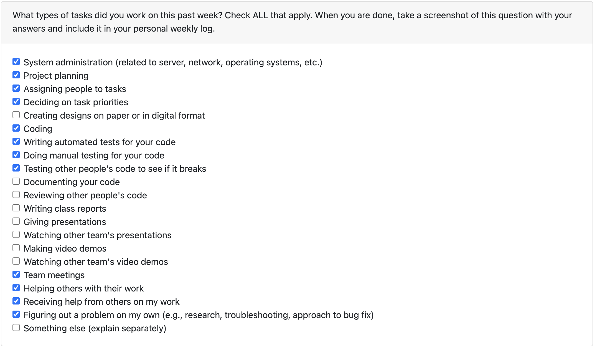

### Tasks completed (from Project Board)

- Added features and prepared the app for the upcoming peer testings.
- Attended weekly meeting and started preparing for the plans for the workstation in next week.
- Reviewed the Peer Evaluation and provided feedback to the team
- Assisted in assigning and prioritizing the tasks for the upcoming milestone.
- Completed the weekly log.
- Assisted in reviewing and merging PRs from team members.

### Recap of personal goals

- Improved the UI on the Settings page whichis now sectioned correctly with coloured icons.
- Improved the loading speed of the app using QuerySnapshot.
- Minor adjustment to the UI from the peer review feedbacks.
- Haptic feedback of the buttons are now added to different part of the screen
- Added choice chips for the allergen and category selection (from the peer review feedbacks)
- Added reverse geocoding for pickup locations and ditched the manual selection of the pickup address.
- Completed the weekly log and contributed to the team log.

### Tasks in progress (from Project Board)

- No other tasks currently in progress.

### Additional Information

N/A.

## Term 2 Week 9: Monday 4th Mar 2024 - Sunday 10th Mar 2024

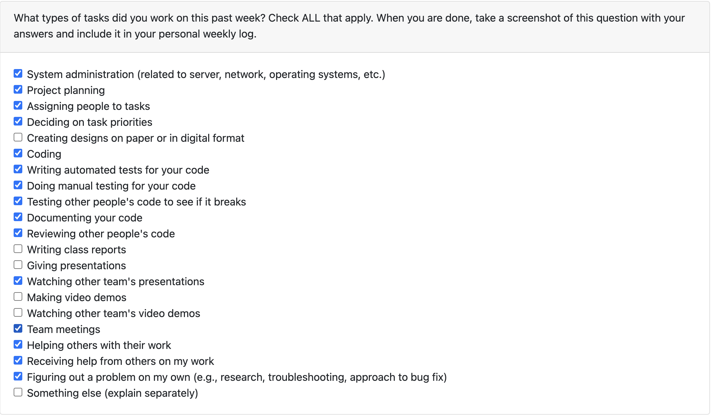

### Tasks completed (from Project Board)

- Attended peer evaluations and provided feedback to the team.
- Assisted in assigning and prioritizing the tasks for the upcoming milestone.
- Completed the weekly log.
- Assisted in reviewing and merging PRs from team members.
- Resolved the bugs in the app and compiled feedback from the peer evaluations.
- Assisted in preparing for the instructions for the peer evaluations.

### Recap of personal goals

- Enhanced the create post screen by incorporating instructional text urging users to navigate the map. Upon positioning the marker, it displays the chosen address.
- Improved the browse screen's marker interaction, reflecting changes when selected.
- Relocated the edit button to the profile page for better accessibility.
- Redesigned the edit profile screen, featuring a prominently larger profile photo avatar for easier interaction.
- Enriched the tab bar by adding labels for improved navigation clarity.
- Addressed and resolved the issue where selecting multiple tags led to overflow on cards and the profile page.
- Optimized the detail page by ensuring tapping on info cards navigates users directly to the respective section, enhancing user experience.

### Tasks in progress (from Project Board)

- No other tasks currently in progress.

### Additional Information

N/A.

## Term 2 Week 10: Monday 11th Mar 2024 - Sunday 17th Mar 2024

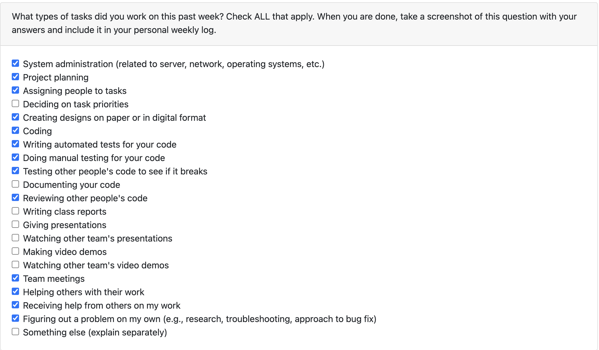

### Tasks completed (from Project Board)

- Assisted in assigning and prioritizing the tasks for the upcoming milestone.
- Completed the weekly log.
- Assisted in reviewing and merging PRs from team members.
- Resolved the bugs in the app and compiled feedback from the peer evaluations.
- Implemented features allowing users to edit or delete their posts directly from the profile page.

### Recap of personal goals

- Implemented features allowing users to edit or delete their posts directly from the profile page.
- Integrated a sharing button that generates and shares a link to the post hosted on the Firebase domain.
- Redesigned the 'Feeling Lucky' button and the pop up modal window
- Addressed and resolved the issue causing lagginess when opening the profile screen.
- Enhanced the image selection process by allowing users to choose their camera source.
- Modified the logic for the tapping area on the order card.

### Tasks in progress (from Project Board)

- No other tasks currently in progress.

### Additional Information

N/A.

## Term 2 Week 10: Monday 18th Mar 2024 - Sunday 17th Mar 2024

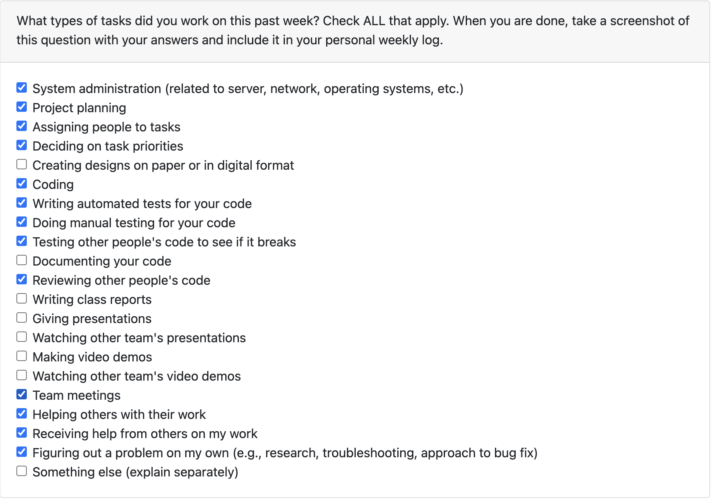

### Tasks completed (from Project Board)

- Completed the weekly log.
- Assisted in reviewing and merging PRs from team members.
- Review Code from last week and resolve some minor ui bugs
- Implemented messaging feature app wise and configured the front end and back end logic
- Assisted in assigning and prioritizing the tasks for the upcoming milestone.

### Recap of personal goals

- Implemented the Conversation Screen, Message Page, and backend logic on Firebase.
- Added the ability to react to a message with ❤️ and 👍. Although it's still buggy I will attempt to address them next week.
- Added UI behaviours to the message page such as when a new message arrives
- Added an option to remove a message If sent accidentally.
- Revamped Donor Review Page.
- Fixed the title overflow on the order card and profile post card

### Tasks in progress (from Project Board)

- No other tasks currently in progress.

### Additional Information

N/A.

## Term 2 Week 10: Monday 24th Mar 2024 - Sunday 31th Mar 2024

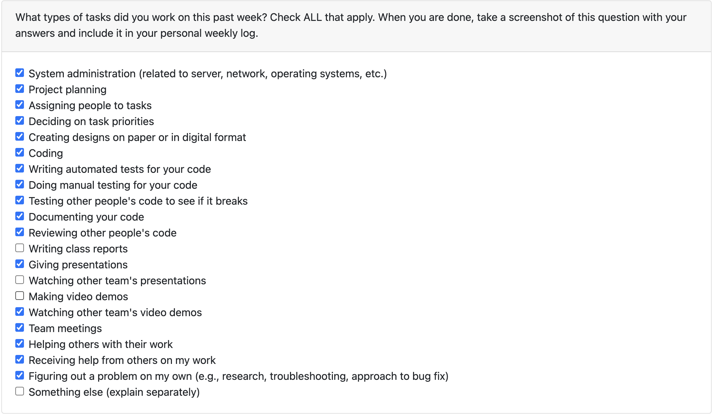

### Tasks completed (from Project Board)

- Completed the weekly log.
- Assisted in reviewing and merging PRs from team members.
- Review Code from last week and resolve some minor ui bugs
- Fixed the bugs in the app and resolved the issues from testing.
- Assisted in assigning and prioritizing the tasks for the upcoming milestone.
- Assisted in preparing for the final presentation and demo.
- Assisted in preparing for the final documentation.

### Recap of personal goals

- Fixed the bugs in the app and resolved the issues from testing.
- Make changes to the donee pathway and match the design and ui with the donor pathway.
- Resolve the bugs with the review page and ensure the pages are reachable to the message screen.
- Assisted in preparing for the final presentation and demo.
- Assisted in preparing for the final documentation.
- Completed the weekly log.
- Assisted in reviewing and merging PRs from team members.

### Tasks in progress (from Project Board)

- No other tasks currently in progress.

### Additional Information

N/A.

## Term 2 Week 10: Monday 1st Apr 2024 - Sunday 7th Apr 2024

### Tasks completed (from Project Board)

- Completed the weekly log.
- Assisted in reviewing and merging PRs from team members.
- Review Code from last week and resolve some minor ui bugs
- Fixed the bugs in the app and resolved the issues from testing.
- Assisted in assigning and prioritizing the tasks for the final milestore

### Recap of personal goals
- Fixed the bugs in the app and resolved the issues from testing.
- Make changes to the color of the homescreen tags and match the design and ui with the donor pathway.
- Assisted in preparing for the final presentation and demo.
- Assisted in preparing for the final documentation.
- Completed the weekly log.

### Tasks in progress (from Project Board)

- No other tasks currently in progress.
  
### Additional Information
- N/A.
